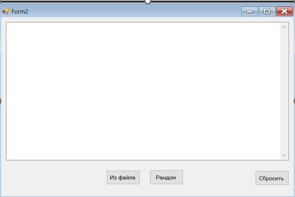

[Описать КЛАСС Ar для работы с одномерным массивом](#T1)<br>
[Программа с ДВУМЯ конструкторами](#T2)<br>
[Gold Fish](#T3)<br>

<br><a name="T1"></a>
## Описать КЛАСС Ar для работы с одномерным массивом
```C#
public Form1()
    {
        InitializeComponent();
    }
        
    // Задача1
    private void button1_Click(object sender, EventArgs e)
    {
        int k;
        string input = tbK.Text;
        if(Int32.TryParse(input, out k))
        {
            tbP.Text += "\r\nС ПЕРВЫМ конструктором\r\n";
            // Объект (с массивом) создается первым конструктором
            Ar ArMas1 = new Ar(k, 10);
            ArMas1.Print(this);
            int nmax1 = ArMas1.Imax();  // вызов метода
            tbP.Text += $"Индекс натб. эл-та: {nmax1} \r\n";
            int sm1 = ArMas1.Sum(nmax1);
            int p1 = ArMas1.Pr(nmax1);
            tbP.Text += $"Сумма до {sm1}\nПроизведение после = {p1} \r\n";
            tbP.Text += $"Кол-во отр.эл-в = {ArMas1.Ko} \r\n";
            tbP.Text += new string('-', 32) + "\r\n";
        }
        else { tbK.Text = "Введите число"; }
    }

    // Задача2
    private void button2_Click(object sender, EventArgs e)
    {
        tbP.Text += "\r\nС ПЕРВЫМ конструктором\r\n";
        // Объект (с массивом) создается первым конструктором
        Ar ArMas2 = new Ar("Input.txt", this);
        ArMas2.Print(this);
        int nmax1 = ArMas2.Imax();  // вызов метода
        tbP.Text += $"Индекс натб. эл-та: {nmax1} \r\n";
        int sm1 = ArMas2.Sum(nmax1);
        int p1 = ArMas2.Pr(nmax1);
        tbP.Text += $"Сумма до {sm1}\nПроизведение после = {p1} \r\n";
        tbP.Text += $"Кол-во отр.эл-в = {ArMas2.Ko} \r\n";
        tbP.Text += new string('-', 32) + "\r\n";
    }

    // Сброс
    private void button3_Click(object sender, EventArgs e)
    {
        tbP.Text = "";
    }
}

internal class Ar
{
    int n;  //кол-во эл-тов в массиве
    int[] a;    // объявление массива
    int ko; //кол. отрицательных эл-тов

    public int Ko
    {
        get
        {
            ko = 0;
            for(int i = 0; i < n; i++)
                if (a[i] < 0) ko++;
            return ko;
        }
    }

    //Первый конструктор заполняет массив
    public Ar(int n, int x)
    {
        this.n = n;
        a = new int[n];
        Random r = new Random();
        for (int i = 0; i < n; i++)
            a[i] = r.Next(-x, x);
    }

    //числами из текста файла с именем в s
    public Ar(string s, Form1 f1)
    {
        try
        {
            StreamReader sr = new StreamReader(s);
            string d = sr.ReadToEnd();
            sr.Close();
            d = d.Replace("\r\n", " ");
            string[] sa = d.Split(' ');
            n = sa.Length;
            a = new int[n];
            for (int j = 0; j < n; j++)
                a[j] = Convert.ToInt32(sa[j]);
        }
        catch
        {
            f1.tbP.Text += "Нет файла";
        }
    }

    // метод для вывода массива на экран
    public void Print(Form1 f1)
    {
        for (int i = 0; i < n; i++)
            f1.tbP.Text += $"{a[i]}";
        f1.tbP.Text += "\r\n";
    }

    //метод возращает индекс максимального эл-та массива
    public int Imax()
    {
        int imax = 0;
        for (int i = 1; i < n; i++)
            if (a[i] > a[imax])
                imax = i;
        return imax;
    }

    //метод возращает сумму эл-тов массива
    public int Sum(int t)
    {
        int sum = 0;
        for(int i = 0; i < t; i++)
            sum += a[i];
        return sum;
    }

    //метод произведение эл-тов массива
    public int Pr(int p)
    {
        int pr;
        if (p < n - 1)
        {
            pr = 1;
            for (int i = p + 1; i < n; i++)
                pr *= a[i];
        }
        else
           pr = 0;
        return pr;
    }
}
```


<br><a name="T2"></a>
## Программа с ДВУМЯ конструкторами

```C#
public partial class Form2 : Form
{
    int first = 0;
    int last = 0;

    public Form2()
    {
        InitializeComponent();
    }

    // Из файла
    private void button1_Click(object sender, EventArgs e)
    {
        tbP.Text += "\r\nС ПЕРВЫМ конструктором\r\n";
        
        Arr ArMas1 = new Arr("Input.txt", this);
        ArMas1.Print(this);

        int sm1 = ArMas1.Sum(ref first, ref last);
        tbP.Text += $"Cумма между {first} и {last} = {sm1}\r\n";
        tbP.Text += $"Кол-во положительных элементов: {ArMas1.Ko}\r\n";
        tbP.Text += new string('-', 32) + "\r\n";
    }

    // Рандомные
    private void button2_Click(object sender, EventArgs e)
    {
        int k = 10;
        tbP.Text += "\r\nС ВТОРЫМ конструктором\r\n";
        
        Arr ArMas2 = new Arr(k);
        ArMas2.Print(this);

        int sm1 = ArMas2.Sum(ref first, ref last);
        tbP.Text += $"Cумма между {first} и {last} = {sm1}\r\n";
        tbP.Text += $"Кол-во положительных элементов: {ArMas2.Ko}\r\n";
        tbP.Text += new string('-', 32) + "\r\n";
    }

    // Сбросить
    private void button3_Click(object sender, EventArgs e) => tbP.Text = "";
}

internal class Arr
{
    int n;  //кол-во эл-тов в массиве
    int[] a;    // объявление массива
    int ko; //кол-во положительных эл-тов

    public Arr(string s, Form2 f1)
    {
        try
        {
            StreamReader sr = new StreamReader(s);
            string d = sr.ReadToEnd();
            sr.Close();
            d = d.Replace("\r\n", " ");
            string[] sa = d.Split(' ');
            n = sa.Length;
            a = new int[n];
            for (int j = 0; j < n; j++)
                a[j] = Convert.ToInt32(sa[j]);
        }
        catch
        {
            f1.tbP.Text += "Файл отсутствует";
        }
    }

    public Arr(int n)
    {
        this.n = n;
        a = new int[n];
        Random r = new Random();
        for (int i = 1; i < n + 1; i++)
            a[i - 1] = i * i * ((r.Next(-1, 2) < 0.5) ? -1 : 1);
    }

    // св-во только для чтения
    public int Ko
    {
        get
        {
            ko = 0;
            for (int i = 0; i < n; i++)
                if (a[i] > 0) ko++;
            return ko;
        }
    }

    // метод для вывода массива на экран
    public void Print(Form2 f1)
    {
        for (int i = 0; i < n; i++)
            f1.tbP.Text += $"{a[i]} ";
        f1.tbP.Text += "\r\n";
    }

    //метод возращает сумму эл-тов массива
    public int Sum(ref int f, ref int l)
    {
        int sum = 0;

        //находим index первого отрицательного елемента
        int i = 0;
        while (a[i] >= 0)
            i++;
        int first = i;

        //находим index последнего отрицательного елемента
        i = a.Length - 1;
        while (a[i] >= 0)
            i--;
        int last = i;

        f = a[first];
        l = a[last];

        for (i = first + 1; i < last; i++)
            sum += a[i];
        return sum;
    }   
}
```


<br><a name="T3"></a>
## Gold Fish
```C#
public partial class Form1 : Form
{
    public Form1()
    {
        InitializeComponent();
    }

    private void Control1_HandleCreated(Object sender, EventArgs e)
    {
        button1.Enabled = true;
    }

    private void button1_Click(object sender, EventArgs e)
    {
        try
        {
            string text1 = Convert.ToString(tb1.Text);
            string text2 = Convert.ToString(tb2.Text);
            string text3 = Convert.ToString(tb3.Text);

            Desire d = new Desire(text1, text2, text3);
            Gold g = new Gold();     //рыбка
            Grandfather gf = new Grandfather();     //дед
            Grandmother gm = new Grandmother();     //бабка

            g.MyEvent += g.DisplayMessage;
            g.MyEvent += gf.DisplayMessage;
            g.MyEvent += gm.DisplayMessage;

            g.DoWish(this);
            gf.TransferWish(this);
            g.DoWish(this);
            gm.ChangeStatus(this);

        }
        catch
        {
            MessageBox.Show("Проверьте исходные данные", "Ошибка ввода", MessageBoxButtons.OK, MessageBoxIcon.Error); //Warning, Information, Error
        }
        tb1.Focus(); // Переводит курсор на элемент.
        tb1.Clear();
        tb2.Clear();
        tb3.Clear();
    }

    // перевод курсор на след. окно
    private void tb1_KeyDown(object sender, KeyEventArgs e)
    {
        if (e.KeyCode == Keys.Enter) => SelectNextControl(ActiveControl, true, true, true, true);
    }

    // проверка на пустоту TextBox
    private void tb1_TextChanged(object sender, EventArgs e)
    {
        if (tb1.Text != "" && tb2.Text != "" && tb3.Text != "")
            button1.Enabled = true;
        else
            button1.Enabled = false;
    }
}

class Desire
{
    public static string[] StrWish = new string[3];

    public Desire(string t1, string t2, string t3)
    {
        StrWish[0] = t1;
        StrWish[1] = t2;
        StrWish[2] = t3;
    }
    public static int Wish = 1;
    public static string[] GrandMother = new string[3];
}

class Grandmother
{
    public Grandmother() { }
    public void DisplayMessage(Form1 f1, string message) => f1.lbP.Text += "Бабка осталась с разбитым корытом\r\n";

    public void ChangeStatus(Form1 f1)
    {
        f1.lbP.Text += "\nСтатус желаний бабки:\r\n";
        Console.ForegroundColor = ConsoleColor.Blue;    //temp
        foreach (var stat in Desire.GrandMother)
            f1.lbP.Text += $"{stat}\r\n";
        Console.ResetColor();   //temp
    }
}

class Grandfather
{
    public Grandfather() { }
    public void DisplayMessage(Form1 f1, string message) => f1.lbP.Text += "Дед боится. Желание не выполнено\r\n";

    public void TransferWish(Form1 f1)
    {
        Gold g = new Gold();
        g.DoWish(f1);
    }
}

class Gold
{
    public Gold() { }
    public delegate void EventHandler(Form1 f1, string message);
    public event EventHandler MyEvent;     // определение обработчика соб.

    public void DisplayMessage(Form1 f1, string message)
    {
        f1.lbP.ForeColor = System.Drawing.Color.Red;
        f1.lbP.Text += $"{message} - это желание не может быть исполнено\r\n";
    }

    public void DoWish(Form1 f1)
    {
        if (Desire.Wish < 3)
        {
            f1.lbP.Text += $"Желание №{Desire.Wish} '{Desire.StrWish[Desire.Wish - 1]}' выполнено\r\n";
            Desire.GrandMother[Desire.Wish - 1] = "выполнен";
            Desire.Wish++;
        }
        else
        {
            MyEvent?.Invoke(f1, $"Желание №{Desire.Wish} '{Desire.StrWish[Desire.Wish - 1]}'");
            Desire.GrandMother[Desire.Wish - 1] = "не выполнен";
        }
    }
}
```
