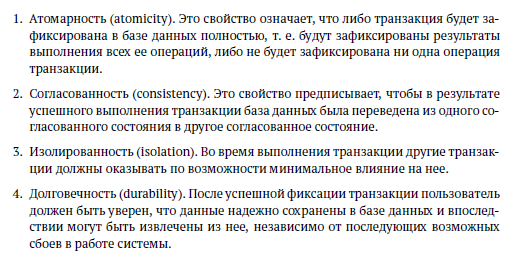
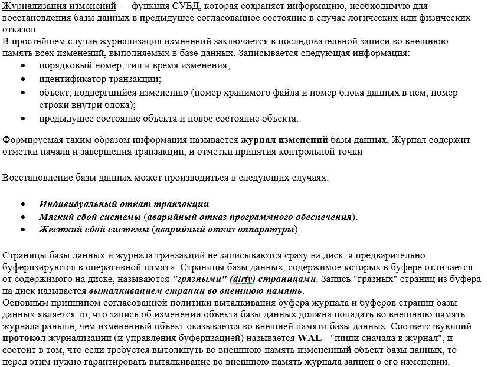
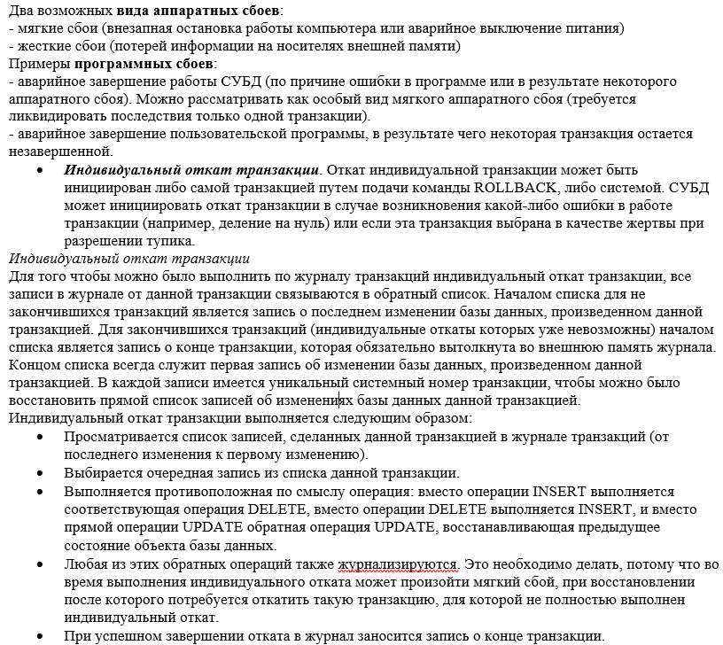
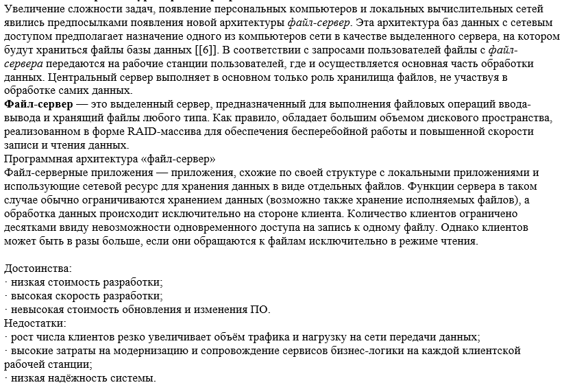
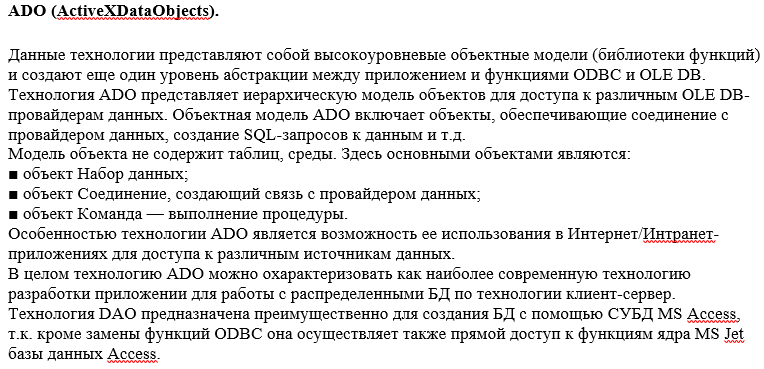
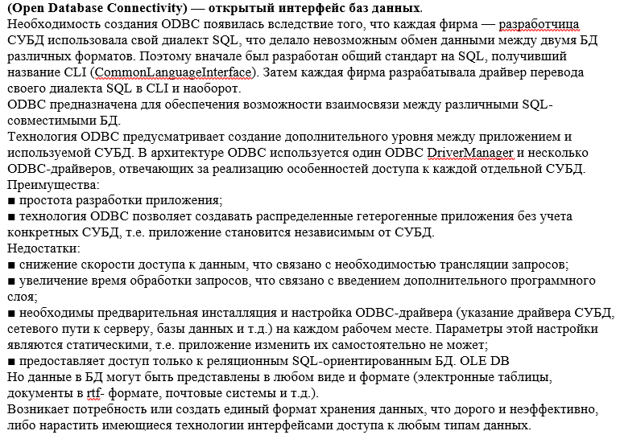
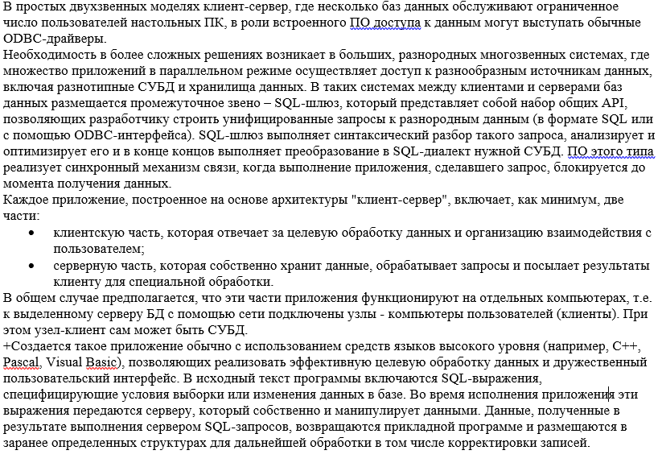
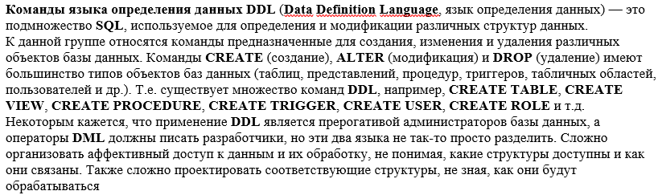

# Содержание
[1. Понятие БД. Предметная область. Архитектура СУБД](#T1) <br>
[2. Хранение данных: базы данных. Отличия от файловых систем.](#T2) <br>
[3. Классификация баз данных](#T3) <br>
[4. Системный каталог, метаданные. Интегрируемость и разделяемость данных.](#T4) <br>
[5. Интерфейсы СУБД. Основные функции СУБД (по Кодду)](#T5) <br>
[6. Функции СУБД: буферизация данных, журнализация изменений БД](#T6) <br>
[7. Уровни моделей БД. Инфологическое, даталогическое, физическое проектирование](#T7) <br>
[8. Возможности CASE-средств для автоматизированного проектирования БД.](#T8) <br>
[9. Проектирование предметной области. Моделирование с помощью нотаций.](#T9) <br>
[10. Семантика БД: обратимость утверждений, генерализация и специализация объектов.Примеры](#T10) <br>
[11. Семантика БД: агрегирование и группировка объектов. Примеры. ](#T11) <br>
[12. ER – модель. Сущности, связи, атрибуты, домены. Пример. ](#T12) <br>
[13. Кардинальность и степень связи. Унарная, бинарная, n – арная связь.](#T13) <br>
[14. Сущность: степень участия. Супертип и подтип. Примеры. ](#T14) <br>
[15. Иерархическая модель данных. Структурное представление данных, навигация. ](#T15) <br>
[16. Обработка данных в иерархической БД. Поддержка целостности данных. ](#T16) <br>
[17. Сетевая модель данных. Типы записей. Правила манипулирования данными. ](#T17) <br>
[18. Достоинства и недостатки ранних моделей БД (ИБД и СБД). ](#T18) <br>
[19. Реляционные БД: требования к реляционной модели (по Кодду). Отношение, кортеж,атрибут, домен](#T19) <br>
[20. РМД: базовое отношение, представление, значение NULL](#T20) <br>
[21. Внешний, первичный, составной, потенциальный ключ РБД. Ограничения ](#T21) <br>
[22. Реляционная алгебра. Операции, поддерживаемые в РМД. ](#T22) <br>
[23. Реляционная алгебра. Операции выборки и проекции данных. Пример. ](#T23) <br>
[24. Реляционная алгебра: Операции пересечения, соединения, объединения. Примеры ](#T24) <br>
[25. Нормальные формы: 1НФ, 2НФ. ](#T25) <br>
[26. РБД: функциональная и транзитивная зависимости атрибутов. 3НФ](#T26) <br>
[27. РБД: хранение данных в последовательном упорядоченном и неупорядоченном файлах. ](#T27) <br>
[28. РБД: индексы; хранение индексов в виде В-деревьев. ](#T28) <br>
[29. РБД: доступ к данным в хешированном файле. Выбор хеш-функции, разрешение коллизий. ](#T29) <br>
[30. Объектно-ориентированная модель БД. Основные концепции и свойства](#T30) <br>
[31. Транзакция. Свойства ACID. ](#T31) <br>
[32. Управление транзакциями. Потерянные обновления. ](#T32) <br>
[33. Управление транзакциями. Чтение «грязных» и несогласованных данных. ](#T33) <br>
[34. Сериализация транзакций. Виды конфликтов. Метод синхронизационных захватов](#T34) <br>
[35. Сериализация транзакций: метод временных меток](#T35) <br>
[36. Журнализация изменения БД: протокол WAL, команды COMMIT и ROLLBACK. ](#T36) <br>
[37. Виды сбоев. Действия СУБД при индивидуальном откате транзакции. ](#T37) <br>
[38. Технология архитектуры «файл-сервер». ](#T38) <br>
[39. Архитектура «клиент-сервер». Технология ADO. ](#T39) <br>
[40. Архитектура «клиент-сервер». Технология ODBC. ](#T40) <br>
[41. Доступ к БД в двухзвенной модели «клиент-сервер».](#T41) <br>
[42. Трехзвенная архитектура СУБД. ](#T42) <br>
[43. SQL: язык описания данных. Команды CREATE, DROP, ALTER. ](#T43) <br>
[44. SQL: язык манипулирования данными. Оператор SELECT. ](#T44) <br>
[45. Стандарты SQL. Уровни соответствия.](#T45) <br>
<br>
<a name="T1"></a>

# 1. Понятие БД. Предметная область. Архитектура СУБД

**База данных (БД)** - это поименованная совокупность структурированных данных.

**Система управления базами данных (СУБД)** - программные средства и языки, позволяющие работать с базами данных.

Уровни

1. **Внутренний** - данные на физическом носителе. (сторона железа)
2. **Концептуальный** - логическое представление БД.
3. **Внешний** - интерфейс.

<br><a name="T2"></a>

# 2. Хранение данных: базы данных. Отличия от файловых систем.

**Хранилище данных**: совокупность информационно-технологических и программно-технических средств и методов, обеспечивающих единую среду хранения данных, оптимизированных для выполнения аналитических операций. 

>База данных отличается от файловой системы структурированностью, организованностью данных, позволяет удобно работать с большим объемом данных

<br><a name="T3"></a>


# 3. Классификация баз данных

> По типу хранимой информации:
- **Документальные** - различные документы: рефераты, библиографические, полнотекстовые. Часто в критерии поиска в качестве признака включается «дата принятия документа», «кем принят» и другие «выходные данные» документов.
- **Фактографические** - информация некой предметнй области в виде фактов. (например, библиографические данные о сотрудниках, данные о выпуске продукции производителя и т.п.). Результат запроса: данные в виде фактов или сообщение об их отсутствии.
- **Лексиграфические** - словари (классификаторы, многоязычные словари, словари основ слов и т.п.)


> По способу хранения данных:
- **Локальные**
 Данные находятся на одном устройстве (диск компьютера или сетевой диск, сервер). В локальных базах, данных применяется метод **блокировки файлов** - пока данные используются одним пользователем, для другого пользователя они заблокированы.

- **Удалённые**
Одновременный доступ к информации нескольким пользователям. При этом для обеспечения доступа к данным вместо механизма блокировки файлов используется механизм транзакции.

>По структуре:
- Неструктурированные
- Частично структурированные
- Структурированные

>Структурированные по типу модели:
- **Иерархические** - древовидная структура со связями из объектов разных уровней
- **Сетевые** - сеть из данных, объединенных между собою ссылками друг на друга
- **Реляционные** - БД, состоящие из соединенных между собой таблиц, хранящих в себе столбцы определенных типов данных.

<br><a name="T4"></a>


# 4. Системный каталог, метаданные. Интегрируемость и разделяемость данных.

**Системный каталог** - это набор таблиц, в которых содержится информация, необходимая для правильного функционирования СУБД: о поддержиfваемых базах данных и их базовых таблицах, представлениях, курсорах, индексах, пользователях и их правах доступа к информации, правилах модификации данных и т.д. В разных СУБД, поддерживающих SQL, существует от десятка до нескольких десятков системных таблиц, структура которых ничем не отличается от уже знакомой нам структуры пользовательских таблиц.

**Метаданные** - то, из чего состоит системный каталог.

**Интегрируемость данных** - Возможность представить БД как объединение отдельных файлов с данными, полностью или частично исключая избыточность хранения данных.

**Разделяемость данных** - Возможность использования несколькими различными пользователями одних и тех же данных в БД

<br><a name="T5"></a>


# 5. Интерфейсы СУБД. Основные функции СУБД (по Кодду).

>Виды интерфейсов:
- **форма и ее генератор** - структурированное и гибкое отображение необходимых данных

- **командный интерфейс** - больше возможностей, но необходимы знания ЯМД

>Требования к реляционным СУБД (по Кодду)

> На уровне языка

5. **Полнота подмножества языка (Comprehensive Data Sublanguage Rule)**. Система управления реляционными базами данных должна поддерживать единственный язык запросов, который позволяет выполнять все операции работы к данным:
операции определения данных, операции манипулирования данными, управление доступом к данным, управление транзакциями.

12. **Согласование языковых уровней (Non-Subversion Rule)**. Не должно быть иного средства доступа к данным, отличного от стандартного языка работы с данными. Если используется низкоуровневый язык доступа к данным, он не должен игнорировать правила безопасности и целостности, которые поддерживаются языком более высокого уровня.

10. **Независимость контроля целостности (Integrity Independence)**. Вся информация, необходимая для поддержания целостности, должна находиться в словаре данных. СУБД должна выполнять проверку заданных ограничений целостности и автоматически поддерживать целостность данных.

4. **Доступ к словарю данных в терминах реляционной модели (Dynamic On-Line Catalog Based on the Relational Model)**. Словарь данных должен сохраняться в форме реляционных таблиц, и СУБД должна поддерживать доступ к нему при помощи стандартных языковых средств.

>На уровне бд

6. **Поддержка обновляемых представлений (View Updating Rule)**. Обновляемое представление должно поддерживать все операции манипулирования данными, которые поддерживают реляционные таблицы: операции выборки, вставки, модификации и удаления данных.

7. **Наличие высокоуровневых операций управления данными (High-Level Insert, Update, and Delete)**. Операции вставки, модификации и удаления данных должны поддерживаться не только по отношению к одной строке реляционной таблицы, но по отношению к любому множеству строк.

11. **Независимость от распределенности (Distribution Independence)**. База данных может быть распределенной, может находиться на нескольких компьютерах, и это не должно оказывать влияние на приложения.

> На уровне ячеек таблицы

1. **Явное представление данных (The Information Rule)**. Информация должна быть представлена в виде данных, хранящихся в ячейках. Данные, хранящиеся в ячейках, должны быть атомарны. Порядок строк в реляционной таблице не должен влиять на смысл данных.

2. **Гарантированный доступ к данным (Guaranteed Access Rule)**. К каждому элементу данных должен быть гарантирован доступ с помощью комбинации имени таблицы, первичного ключа строки и имени столбца.

3. **Полная обработка неизвестных значений (Systematic Treatment of Null Values)**. Неизвестные значения (NULL), отличные от любого известного значения, должны поддерживаться для всех типов данных при выполнении любых операций.

>На уровне приложений

9. **Логическая независимость данных (Logical Data Independence)**. Представление данных в приложении не должно зависеть от структуры реляционных таблиц.

8. **Физическая независимость данных (Physical Data Independence)**. Приложения не должны зависеть от используемых способов хранения данных на носителях, от аппаратного обеспечения компьютеров, на которых находится реляционная база данных.

<br>
<br><a name="T6"></a>

# 6. Функции СУБД: буферизация данных, журнализация изменений БД.

**Журнализация** - запись сеанса взаимодействия пользователя с бд для возможности дальнейшего восстановления в случае сбоя системы

**Буферизация** служит для ускорения работы системы с БД и заключается в записи данных из журнала не сразу на диск, а предварительно в оперативную память.

**Протокол WAL - Write Ahead Log** - записи в журнале об изменении объекта некой бд выталкиваются во внешнюю память раньше самих изменений

<br>
<br><a name="T7"></a>

# 7. Уровни моделей БД. Инфологическое, даталогическое, физическое проектирование.

> Уровни моделей БД
- **Физический** - все данные БД, которые содержатся в таблицах/файлах/на внешних носителях

- **Концептуальный** - предмет устройства, архитектуры, соединений БД.

- **Внешний** - отдельные единицы данных, необходимые для конкретного пользователя/приложения. (Остальные ненужные данные игнорируются)

**Логическая независимость** – Независимость друг от друга приложений, взаимодействующих с одной и той же БД (это возможность изменения одного приложения без корректировки других приложений, работающих с этой же БД. )

**Физическая независимость** – это возможность переноса хранимой информации с одних носителей на другие при сохранении работоспособности всех приложений.

**Инфологическое концептуальное проектирование** - построение обобщенной, не имеющей конкретики, модели базы данных с описанием ее объектов и связей между ними;

**Даталогическое логическое проектирование** - создание схемы базы данных с учетом специфики конкретной модели данных; (связи между таблицами)

**Физическое проектирование** - построение схемы базы данных под конкретную СУБД. При таком проектировании учитываются ограничения на именование объектов базы данных, ограничения на определенные типы данных, физические условия хранения данных в БД (разделение по файлам и устройствам), возможность доступа к БД.

<br>
<br><a name="T8"></a>

# 8. Возможности CASE-средств для автоматизированного проектирования БД.

CASE-средства позволяют существенно сократить время на разработку БД и уменьшить количество ошибок в них.

>Виды Case-средств

**S-Designor(SDP)** - графический case-инструмент, позволяет проектировать как концептуальную, так и физическую модель БД, имея возможность перехода от одного этапа к другому.

**Database Designer(ORACLE)** - инструмент, позволяет после анализирования предметной области программировать и проектировать БД, проводить настройку, оценку и тестирование.

**Erwin(Logic Works)** - инструмент для создания концептуальных и логических схем данных, позволяет редактировать различные наборы данных в виде таблиц, разрабатывать структуры, скрипты, настраивать шаблоны, выводить информацию в виде отчетов, строить диаграммы

<br><br><a name="T9"></a>


# 9. Проектирование предметной области. Моделирование с помощью нотаций.

Предметная область характеризуетя объектами и процессами.

При проектировании, предметная область рассматривается в виде трех представлений:

1. Предметная область без изменений, такая, какая она есть
2. Предметная область как ее вопринимает проектировщик БД
3. Предметная область описанная в виде символов

Этапы:

1. **Построение концептуальной модели** (сущность - связь) - анализ и изучение предметной области, сбор данных для пострения модели; выявление фрагментов, построение связей между ними; создание концпетуальной модели.

2. **Логическое проектирование** - построение моделей со структурами, ориентированными на СУБД и спецификации прикладных программ и их сравнительный анализ.

3. **Физическое проектирование** - определение особенностей хранения данных, методов доступа и т.д.

Моделирование в нотации eEPC представляет собой описание описание последовательности шагов бизнес-процесса, выполняемых сотрудниками(отделами, департаментами), которые позволяют осуществить связь между организационной и функциональными моделями.

<br><br><a name="T10"></a>


# 10. Семантика БД: обратимость утверждений, генерализация и специализация объектов. Примеры. 

Модель ER обладает способностью представлять сущности БД в виде иерархической модели. Выше по иерархии располагаются более обобщенные представления о сущностях, тогда как ниже по иерархии сущности рассмотриваются более детально.

Подъем по иерархии (сущности объединяются, более обобщенное представление) - **генерализация**, спуск - **специализация**

Пример: 
- генерализация: Иванов Иван -> ученик 8А -> школьник -> человек
- специализация: человек -> школьник -> ученик 8А -> Иванов Иван

<br><br><a name="T11"></a>


# 11. Семантика БД: агрегирование и группировка объектов. Примеры.

**Агрегирование** - объединение нескольких элементов в единое целое (MIN, MAX, AVG)
```SQL
SELECT MAX(price) FROM book;
```

**Группировка данных** - это процедура объединения в логическом порядке строк с. определенными значениями. 

```SQL
SELECT age, SUM(salary) FROM people
GROUP BY age;
```

<br><br><a name="T12"></a>


# 12. ER – модель. Сущности, связи, атрибуты, домены. Пример.

**Entity-relational** - концептуальная модель высокого уровня, представляет собой модель из сущностей и отношений между ними

**Сущность** - объект, событие или явление, то, что хранит данные в БД, имеет атрибуты, представляющие эту сущность. **Пример**: человек - работник, студент, пациент.

**Отношения** - объединение двух или более сущностей: Том работает в химическом отделе

**Атрибут** - свойство сущности или типа связи. **Пример**: лекция может иметь атрибуты время, дата, продолжительность, место...

Виды
- простой атрибут - не могут быть разделены дальше: номер студента

- композитный - можно разбить на составные атрибуты: полное имя можно разбить на имя и фамилию

- производный: не хранится в БД напрямую, получается из других атрибутов, хранящихся в БД: возраст человека вычисляется по дате его рождения

- многозначный - несколько значений: несколько номеров телефонов, несколько электронных почт

**Домен** - множество допустимых значений для определенного типа. Пример: имя состоит из русских букв, не содержит цифры, длиной от 5 до 20 символов.

<br><br><a name="T13"></a>


# 13. Кардинальность и степень связи. Унарная, бинарная, n – арная связь.

**Кардинальность** – количество возможных связей для каждой из сущностей-участниц (One-To-One, One-To-Many, Many-To-Many). Количество связей для сущности

**Степень связи** – количество типов отношений, которые охвачены данной связью

Для связи «один к одному» кардинальности будут равны  1 и 1, для связей «один ко многим» - 1 и N (часто вместо N используется знак ∞ - «бесконечность» или просто символ «звездочка» ′*′), для связи «многие к одному » - N и 1, для связи «многие ко многим» - N и N. 

-унарная связь – связь, которая определена на одной сущности. Самый простой пример – иерархическая структура.
−  бинарные связи (между двумя отношениями или между отношением и ем же самим - рекурсивная связь),
−  и в общем случае - n-арные связи.


<br><br><a name="T14"></a>


# 14. Сущность: степень участия. Супертип и подтип. Примеры.

**Степень участия** – определяет, зависит ли существование некой сущности от участия в связи некой другой сущности.

Пример. Сущность Автомобиль можно разбить на следующие подтипы: автомобили с приводом на два колеса, автомобили с приводом на четыре колеса, автомобили с переключаемым приводом.

<br><br><a name="T15"></a>


# 15. Иерархическая модель данных. Структурное представление данных, навигация. 

В иерархии главный элемент - корень, древовидная структура с потомками.

**Структура данных** — это коллекция, который хранит данные в определенном макете.

**Линейные**, элементы образуют последовательность или линейный список, обход узлов линеен. Примеры: Массивы. Связанный список, стеки и очереди.

**Нелинейные**, если обход узлов нелинейный, а данные не последовательны. Пример: граф и деревья.

<br><br><a name="T16"></a>

# 16. Обработка данных в иерархической БД. Поддержка целостности данных. 

Проход ИБД слева-направо сверху-вниз. .Все  операции по изменению данных (выборка, удаление, обновление и т.п.) осуществляются по одной записи единовременно.

Поиск в ИБД осуществляется либо с помощью указателей, которые отслеживают, какая запись обрабатывалась последней, либо извлечением/вставкой записи, удовлетворяющей заданным условиям.

**Поддержка ограничений целостности**: 
- дочерняя запись не может существовать независимо от родителя (т.е. обеспечивается целостность связи между владельцем и участниками группового отношения); 
- если родительская запись удаляется, то все подчиненные (дочерние) автоматически будут удалены; 
- при внесении в родительскую запись каких-либо изменений они будут унаследованы всеми дочерними записями. Каскадные удаления или обновления могут приводить к потере данных.

<br><br><a name="T17"></a>

# 17. Сетевая модель данных. Типы записей. Правила манипулирования данными. 

Сетевые - сеть из данных, объединенных между собою ссылками друг на друга

Плюсы: минимум избыточности данных, потомки могут иметь любое число предков

Минусы: сложности в навигации

Типы записей: предки и потомки (1 к многим)

**Операции с данными**: удалить/сохранить/обновить запись, переключить связь на другого владельца, ликвидировать связь, извлечь запись по критериям.

<br><a name="T18"></a>

# 18. Достоинства и недостатки ранних моделей БД (ИБД и СБД).

Плюсы:
- Развитые средства управления данными во внешней памяти на низком уровне;

- Возможность построения вручную эффективных прикладных систем;

- Возможность экономии памяти за счет разделения подобъектов (в сетевых системах).


Минусы:

- сложность использования
- высокий уровень требований к знаниям о физической организации БД
- зависимость прикладных систем от физической организации БД
- перегруженность логики прикладных систем деталями организации доступа к БД

<br><a name="T19"></a>

# 19. Реляционные БД: требования к реляционной модели (по Кодду). Отношение, кортеж, атрибут, домен. 

**Реляционные** - БД, состоящие из соединенных между собой таблиц, хранящих в себе столбцы определенных типов данных.

**Кортеж** - строка отношения. Элементы кортежа - строки таблицы

**Атрибуты отношения** - столбцы таблицы

**Отношение** - структура данных целиком, набор записей(таблица)

**Домен** - диапазон допустимых значений атрибута

>Требования к реляционным СУБД (по Кодду)

> На уровне языка

5. **Полнота подмножества языка (Comprehensive Data Sublanguage Rule)**. Система управления реляционными базами данных должна поддерживать единственный язык запросов, который позволяет выполнять все операции работы к данным:
операции определения данных, операции манипулирования данными, управление доступом к данным, управление транзакциями.

12. **Согласование языковых уровней (Non-Subversion Rule)**. Не должно быть иного средства доступа к данным, отличного от стандартного языка работы с данными. Если используется низкоуровневый язык доступа к данным, он не должен игнорировать правила безопасности и целостности, которые поддерживаются языком более высокого уровня.

10. **Независимость контроля целостности (Integrity Independence)**. Вся информация, необходимая для поддержания целостности, должна находиться в словаре данных. СУБД должна выполнять проверку заданных ограничений целостности и автоматически поддерживать целостность данных.

4. **Доступ к словарю данных в терминах реляционной модели (Dynamic On-Line Catalog Based on the Relational Model)**. Словарь данных должен сохраняться в форме реляционных таблиц, и СУБД должна поддерживать доступ к нему при помощи стандартных языковых средств.

>На уровне бд

6. **Поддержка обновляемых представлений (View Updating Rule)**. Обновляемое представление должно поддерживать все операции манипулирования данными, которые поддерживают реляционные таблицы: операции выборки, вставки, модификации и удаления данных.

7. **Наличие высокоуровневых операций управления данными (High-Level Insert, Update, and Delete)**. Операции вставки, модификации и удаления данных должны поддерживаться не только по отношению к одной строке реляционной таблицы, но по отношению к любому множеству строк.

11. **Независимость от распределенности (Distribution Independence)**. База данных может быть распределенной, может находиться на нескольких компьютерах, и это не должно оказывать влияние на приложения.

> На уровне ячеек таблицы

1. **Явное представление данных (The Information Rule)**. Информация должна быть представлена в виде данных, хранящихся в ячейках. Данные, хранящиеся в ячейках, должны быть атомарны. Порядок строк в реляционной таблице не должен влиять на смысл данных.

2. **Гарантированный доступ к данным (Guaranteed Access Rule)**. К каждому элементу данных должен быть гарантирован доступ с помощью комбинации имени таблицы, первичного ключа строки и имени столбца.

3. **Полная обработка неизвестных значений (Systematic Treatment of Null Values)**. Неизвестные значения (NULL), отличные от любого известного значения, должны поддерживаться для всех типов данных при выполнении любых операций.

>На уровне приложений

9. **Логическая независимость данных (Logical Data Independence)**. Представление данных в приложении не должно зависеть от структуры реляционных таблиц.

8. **Физическая независимость данных (Physical Data Independence)**. Приложения не должны зависеть от используемых способов хранения данных на носителях, от аппаратного обеспечения компьютеров, на которых находится реляционная база данных.

<br><a name="T20"></a>

# 20. РМД: базовое отношение, представление, значение NULL.

Null значение не определено, относится к любому типу, может соответствовать любому значению

**Базовое отношение** - это именованное отношение, которое не является производным. Существование базового отношения не зависит от существования других отношений.
**Представление** - это именованное производное отношение. Представлены в базе данных в виде определения. Представление не хранится в физической памяти системы управления базой данных (СУБД), а формируется с использованием других именованных отношений.

**Базовое отношение** - именованное отношение, которое не является производным

**Представление** - производное именованное отношение

<br><a name="T21"></a>

# 21. Внешний, первичный, составной, потенциальный ключ РБД. Ограничения целостности.

**Внешний ключ** – это одно или несколько полей (атрибутов), которые являются первичными в другой таблице и значение которых заменяется значениями первичного ключа другой таблицы.

**Первичный ключ** – это поле, которое используется для обеспечения уникальности данных в таблице. Составные (сложные) ключи – это ключи, которые содержат несколько полей (атрибутов).

**Потенциальный ключ** – это минимальный набор атрибутов, по значениям которых можно однозначно выбрать требуемый экземпляр сущности. Потенциальный ключ играет роль адреса кортежа в таблице

К ограничениям целостности относятся ограничение первичного ключа PRIMARY KEY, ограничение внешнего ключа FOREIGN KEY, ограничение уникальности UNIQUE, ограничение значения NULL, ограничение на проверку CHECK 

<br><a name="T22"></a>


# 22. Реляционная алгебра. Операции, поддерживаемые в РМД.

Операции над отношениями, результат - новое отношение.

Две группы: над **множествами**(пересечение, объединение, разность, декартово произведение (фонтанчиком)), над **отношениями** (выборка(по строкам), проекция(столбцы), соединение)

<br><a name="T24"></a>

# 24. Реляционная алгебра. Операции, поддерживаемые в РМД.

Объединение
```SQL
запрос1
UNION
запрос2
```
Пересечение AND

Объединение , JOIN

<br><a name="T25"></a>

# 25. Нормальные формы: 1НФ, 2НФ

1ФН:
-	В таблице не должно быть дублирующих строк
-	В каждой ячейке таблицы хранится атомарное значение (одно не составное значение)
-	В столбце хранятся данные одного типа
-	Отсутствуют массивы и списки в любом виде

2ФН:

- таблица должна находиться в первой нормальной форме
-	Таблица должна иметь ключ
-	Все неключевые столбцы таблицы должны зависеть от полного ключа (в случае если он составной)

<br><a name="T26"></a>

# 26. РБД: функциональная и транзитивная зависимости атрибутов. 3НФ 

A -> B AND B->A => A<->B

A->B B->C, А не зависит функционально ни от B ни от C


>Атрибут В функционально зависит от атрибута А, если каждому значению А соответствует в точности одно значение В.
Обозначение : A → B. Это значит, что во всех кортежах с одинаковым значением атрибута А атрибут В будет иметь также одно и то же значение.
Если существует функциональная зависимость вида A→B и В→А, то между А и В имеется взаимно однозначное соответствие , или функциональная зависимость .
Обозначение : A↔B или В↔А.
Если отношение находится в 1НФ, то все неключевые атрибуты функционально зависят от ключа с различной степенью зависимости.
Частичная зависимость (частичная функциональная зависимость) – зависимость неключевого атрибута от части составного ключа.
Полная функциональная зависимость – зависимость неключевого атрибута от всего составного ключа.

Атрибут С зависит от атрибута А транзитивно (существует транзитивная зависимость ), если для атрибута А, В, С выполняются условия A→B и В→С, по обратной зависимости отсутствуют.
Третья нормальная форма предполагает, что каждый столбец, не являющийся ключом, должен зависеть только от столбца, который является ключом, то есть должна отсутствовать транзитивная функциональная зависимость (transitive functional dependency)
Транзитивная функциональная зависимость выражается следующим образом: А → В и В → С. То есть атрибут С транзитивно зависит от атрибута А, если атрибут С зависит от атрибута В, а атрибут В зависит от атрибута А (при условии, что атрибут А функционально не зависит ни от атрибута В, ни от атрибута С).
Если столбец зависит не только от первичного ключа, то данный столбец находится не в той таблице, в которой он должен находиться, либо же является производным от других столбцов.

>3НФ: 
отсутстивие транзитивной зависимости.

<br><a name="T27"></a>

# 27. РБД: хранение данных в последовательном упорядоченном и неупорядоченном файлах. 

**Неупорядоченные файлы**
Неупорядоченный файл (который иногда называют кучей) имеет простейшую структуру. Записи размещаются в файле в том порядке, в котором они в него вставляются. Каждая новая запись помещается на последнюю страницу файла, а если на последней странице для нее не хватает места, то в файл добавляется новая страница. 

Плюсы:
- удобно вставлять


Минусы
- неудобно искать строки (долгий линейный поиск)
- очистка места после удаления записей
- регулярная реорганизация

**Упорядоченные файлы** Записи в файле можно отсортировать по значениям одного или нескольких полей и таким образом образовать набор данных, упорядоченный по некоторому ключу. Поле (или набор полей), по которому сортируется файл, называется полем упорядочения

Плюсы
- быстрый поиск строки


Минусы
- операции вставки и удаления
происходят с использованием 
временный неотсортированный файл, который называется файлом переполнения (overflow file) или файлом транзакции (transaction file). 


<br><a name="T28"></a>

# 28. РБД: индексы; хранение индексов в виде В-деревьев. 

**Индекс** - это способ реляционной базы данных предварительно сортировать данные в разнообразных порядках, реализуемых одновременно.

Построение В-деревьев связано с простой идеей создания индекса над уже построенным индексом. 

Число шагов при этом для поиска любой записи основного файла одинаково и равно количеству уровней в дереве.
Такие деревья называют **сбалансированными**(путь от корня до любого листа одинаков) Таким образом, термин В-дерево происходит от английского balance (баланс). 

<br><a name="T29"></a>

# 29. РБД: доступ к данным в хешированном файле. Выбор хеш-функции, разрешение коллизий

Хеширование - свертка c перемешиванием, хеш функция обрабатывает значение ключа, возвращая соответствующее ему значенеи меньшео размера, по которому осуществляется доступ к кортежу

Использование хеширования предполагает, что множество всех ключевых данных уже определено и хранится в табличном виде (хештаблица)

Хеш-функция может быть выбрана разными способами. Основное требование, предъявляемое к ней, - поддержка максимально равномерного распределения записей в файле. 

На практике возможны конфликтные ситуации, когда хеш-функция возвращает одну и ту же свертку для нескольких значений ключа. Такие случаи называются коллизиями, а кортежи, содержащие эти ключи, - синонимами. Коллизии снижают эффективность механизма перемешивания и усложняют обработку запросов к памяти. Для разрешения коллизий существует несколько способов, основными из которых являются: 
- открытая адресация; 
- связанная область переполнения; 
- многократное хеширование. 

<br><a name="T30"></a>

# 30. Объектно-ориентированная модель БД. Основные концепции и свойства. 

Предполагается, что объектно-ориентированные технологии должны преодолеть типичные ограничения, свойственные реляционному подходу:
- из-за возможности моделирования только плоских двумерных таблиц, в реляционной модели затруднено представление данных, имеющих сложную структуру
- система должна гарантировать пользователю возможность корректного представления в БД специальных данных, но
множество типов данных, предлагаемых реляционной СУБД, не может отразить все свойства данных пользователя
- При отображении данных сложной структуры часто бывает
необходимо определить набор операций именно для данных конкретного типа. Так как РМД не предусматривает этого, то дополнительная работа возлагается на пользователя.
- затрудненный интерфейс между языком программирования и языком баз данных. 

Основой развития концепций ООБД являются как уже проведенные
исследования по данной теме, так и языки программирования с абстрактными типами данных и объектно-ориентированные языки программирования
>Свойства для ООСУБД:
1.    Сложные объекты.
2.    Идентифицируемость объектов.
3.    Инкапсуляция.
4.    Типы и классы.
5.    Иерархии типов или классов. связи вида “классподкласс”
6.    Перекрытие, перегрузка и позднее связывание
7.    Вычислительная полнота.
8.    Расширяемость
9.    Стабильность (перманентность данных).
10.    Управление вторичной памятью.
11.    . Параллелизм.(несколько пользователей) 
12.    Восстановление.
13.    . Средства обеспечения незапланированных запросов

<br><a name="T31"></a>

# 31. Транзакция. Свойства ACID. 

А - атомарность; 

С - согласованность

И - изолированность

Д - долговечность




<br><a name="T32"></a>

# 32. Транзакция. Потерянные обновления. 

Одна транзаккия перезаписала данные, измененные и зафиксированные в другой транзакции

<br><a name="T33"></a>

# 33. Транзакция. Грязные данные. 

Транзакция читает данные, измененные параллельной транзакцией, которая еще не завершилась. Если такая транзакция откатится, то первая транзакция прочитает данные, которых нет в системе (СТРОКИ МЕНЯЮТ СВОЕ ЗНАЧЕНИЕ)

Неповторяющееся чтение - запросы по одним и тем же данным могут отличаться, если между запросами другая транзакция успеет изменить и зафиксировать эти данные

Фантомное чтение - изменение количества строк, соответствующих условию

<br><a name="T34"></a>

# 34. Сериализация транзакций. Виды конфликтов. Метод синхронизационных захватов.

<br><a name="T35"></a>

# 35. Сериализация транзакций: метод временных меток.

<br><a name="T36"></a>

# 36. Журнализация изменения БД: протокол WAL, команды COMMIT и ROLLBACK.


<br><a name="T37"></a>

# 37. Виды сбоев. Действия СУБД при индивидуальном откате транзакции.




<br><a name="T38"></a>

# 38. Технология архитектуры «файл-сервер»



<br><a name="T39"></a>

# 39. Архитектура «клиент-сервер». Технология ADO.

Двузвенная: обработка запроса происходит на одной машине. Плюсы: надежность. Минусы: требования к производительности

Трехзвенная: обработка запроса происходит несколькими машинами. Плюсы: скорость. Минусы: надежность



<br><a name="T40"></a>

# 40. Архитектура «клиент-сервер». Технология ODBC.



<br><a name="T41"></a>


# 41. Доступ к базам данных в двухзвенных моделях «клиент-сервер»



<br><a name="T42"></a>

# 42. Трехзвенная (многозвенная) архитектура "клиент – сервер".


<br><a name="T43"></a>

# 43. SQL: язык описания данных. Команды CREATE, DROP, ALTER.

    ```SQL
    FOREIGN KEY (seller_id) REFERENCES sellers (seller_id) ON DELETE CASCADE
    ```

    ALTER ADD/RENAME TO/ DROP COLUMN/ CHANGE NAME


