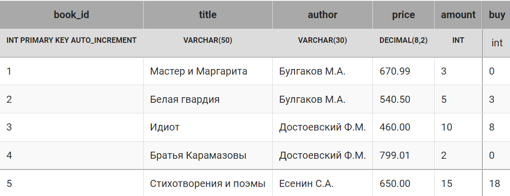

# Запросы корректировки данных

### Содержание <br>
[Создание пустой таблицы](#T1)<br>
[Добавление записей в таблицу](#T2)<br>
[Добавление записей из другой таблицы, вложенные запросы](#T3)<br>
[Запросы на обновление](#T4)<br>
[Запросы на обновление нескольких столбцов](#T5)<br>
[Запросы на обновление нескольких таблиц](#T6)<br>
[Запросы на удаление](#T7)<br>
[Запросы на создание таблицы](#T8)<br>


<br>

<br><a name="T1"></a>
# Создание пустой таблицы

Создание таблицы осуществляется с помощью запроса `CREATE`, подробно рассмотренного в [первой странице](https://github.com/EMIR1HUB/All_Conspectus/blob/main/SQL/1_base_Table.md).

#### **Пример** Создать таблицу поставка (`supply`), которая имеет ту же структуру, что и таблиц `book`.

```SQL
CREATE TABLE supply(
    supply_id INT PRIMARY KEY AUTO_INCREMENT,
    title VARCHAR(50),
    author VARCHAR(30),
    price DECIMAL(8,2),
    amount INT
)
```
___


<br><a name="T2"></a>
# Добавление записей в таблицу

Добавление одной записи в таблицу осуществляется с помощью запроса INSERT, подробно рассмотренного в [первой странице](https://github.com/EMIR1HUB/All_Conspectus/blob/main/SQL/1_base_Table.md).

#### **Пример** Занесите в таблицу `supply` четыре записи:

```SQL
INSERT INTO supply(title, author, price, amount)
VALUES ('Лирика', 'Пастернак Б.Л.', 518.99, 2),
    ('Черный человек', 'Есенин С.А.', 570.20, 6),
    ('Белая гвардия', 'Булгаков М.А.', 540.50, 7),
    ('Идиот', 'Достоевский Ф.М.', 360.80, 3);

SELECT * FROM supply;

--решение
+-----------+----------------+------------------+--------+--------+
| supply_id | title          | author           | price  | amount |
+-----------+----------------+------------------+--------+--------+
| 1         | Лирика         | Пастернак Б.Л.   | 518.99 | 2      |
| 2         | Черный человек | Есенин С.А.      | 570.20 | 6      |
| 3         | Белая гвардия  | Булгаков М.А.    | 540.50 | 7      |
| 4         | Идиот          | Достоевский Ф.М. | 360.80 | 3      |
+-----------+----------------+------------------+--------+--------+
```
___


<br><a name="T3"></a>
# Добавление записей из другой таблицы, вложенные запросы

С помощью запроса на добавление можно добавить записи из другой таблицы, отобранные с помощью запроса на выборку. В этом случае вместо раздела `VALUES` записывается запрос на выборку, `SELECT`.  В нем можно использовать `WHERE`, `GROUP BY`, `ORDER BY`.

Правила соответствия между полями таблицы и вставляемыми значениями из запроса:

1. количество полей в таблице и в запросе должны совпадать;
2. должно существовать прямое соответствие между позицией одного и того же элемента в обоих списках, первый столбец запроса к первому столбцу в списке столбцов таблицы, второй – ко второму и т.д.
3. типы столбцов запроса должны быть совместимы с типами данных соответствующих столбцов таблицы ( `INT` можно занести в поле типа `DECIMAL`, обратная операция – недопустима).

#### **Пример** Занести все книги из таблицы `supply` в таблицу `book`
```SQL
INSERT INTO book (title, author, price, amount) 
SELECT title, author, price, amount 
FROM supply;
```
> С помощью этого запроса в таблицу `book` включены все книги из `supply`, даже те, которые в `book` уже есть («Белая гвардия» и «Идиот»). Для реляционной модели это нежелательная ситуация. Устранить эту проблему можно с помощью вложенных запросов.

#### **Пример** Занести из таблицы `supply` в таблицу `book` только те книги, названия которых отсутствуют в таблице `book`.
```SQL
INSERT INTO book (title, author, price, amount) 
SELECT title, author, price, amount 
FROM supply
WHERE title NOT IN (
        SELECT title 
        FROM book
        );

SELECT * FROM book;
```
> Вложенным запросом отбираются все названия книг, которые есть в таблице `book`. Основным запросом `SELECT` из таблицы `supply` выбираются книги, названия которых нет в результате вложенного запроса. Отобранные записи добавляются в конец таблицы `book`.
___

<br><a name="T4"></a>
# Запросы на обновление

Обновлением данных - изменение значений в существующих записях таблицы. Возможно как изменение значений полей в группе строк (даже всех строк таблицы), так и правка значения поля отдельной строки.

Изменение записей в таблице реализуется с помощью запроса `UPDATE`.
```SQL
UPDATE таблица SET поле = выражение
```

#### **Пример** Уменьшить на 30% цену книг в таблице `book`.
```SQL
UPDATE book 
SET price = 0.7 * price;
```
С помощью запросов на обновление можно также изменять только часть записей. С помощью ключевого слово `WHERE`, после которого указывается условие отбора строк для изменения.

#### **Пример** Уменьшить на 30% цену тех книг в таблице `book`, количество которых меньше 5.

```SQL
UPDATE book 
SET price = 0.7 * price 
WHERE amount < 5;

SELECT * FROM book;

--результат
Affected rows: 2
Query result:
+---------+-----------------------+------------------+--------+--------+
| book_id | title                 | author           | price  | amount |
+---------+-----------------------+------------------+--------+--------+
| 1       | Мастер и Маргарита    | Булгаков М.А.    | 469.69 | 3      |
| 2       | Белая гвардия         | Булгаков М.А.    | 540.50 | 5      |
| 3       | Идиот                 | Достоевский Ф.М. | 460.00 | 10     |
| 4       | Братья Карамазовы     | Достоевский Ф.М. | 559.31 | 2      |
| 5       | Стихотворения и поэмы | Есенин С.А.      | 650.00 | 15     |
+---------+-----------------------+------------------+--------+--------+
```
В этом запросе обновляется только 2 записи (1 и 4 книги).
___


<br><a name="#T5"></a>
# Запросы на обновление нескольких столбцов

Запросом `UPDATE` можно обновлять значения нескольких столбцов одновременно.

```SQL
UPDATE таблица SET поле1 = выражение1, поле2 = выражение2
```

На складе, кроме хранения и получения книг, выполняется их оптовая продажа. Для реализации этого действия включим дополнительный столбец `buy`  в таблицу `book`:


#### **Пример** В столбце `buy` покупатель указывает количество книг, которые он хочет приобрести. Для каждой книги, выбранной покупателем, необходимо уменьшить ее количество на складе на указанное в столбце `buy` количество, а в столбец buy занести 0.

```SQL
UPDATE book 
SET amount = amount - buy,
    buy = 0;

SELECT * FROM book;

--результат

+---------+-----------------------+------------------+--------+--------+-----+
| book_id | title                 | author           | price  | amount | buy |
+---------+-----------------------+------------------+--------+--------+-----+
| 1       | Мастер и Маргарита    | Булгаков М.А.    | 670.99 | 3      | 0   |
| 2       | Белая гвардия         | Булгаков М.А.    | 540.50 | 2      | 0   |
| 3       | Идиот                 | Достоевский Ф.М. | 460.00 | 2      | 0   |
| 4       | Братья Карамазовы     | Достоевский Ф.М. | 799.01 | 2      | 0   |
| 5       | Стихотворения и поэмы | Есенин С.А.      | 650.00 | -3     | 0   |
+---------+-----------------------+------------------+--------+--------+-----+
```
> Как видно из таблицы, без проверки данных, которые занесены в столбец,  нельзя запускать запрос на обновление (может получиться отрицательное значение количества).

#### **Пример** В таблице `book` необходимо скорректировать значение для покупателя в столбце `buy` таким образом, чтобы оно не превышало количество экземпляров книг, указанных в столбце `amount`. А цену тех книг, которые покупатель не заказывал, снизить на 10%.

```SQL
UPDATE book
SET buy = IF(buy >= amount, amount, buy),
    price = IF(buy = 0, price * 0.9, price);

SELECT * FROM book;

--результат
+---------+-----------------------+------------------+--------+--------+-----+
| book_id | title                 | author           | price  | amount | buy |
+---------+-----------------------+------------------+--------+--------+-----+
| 1       | Мастер и Маргарита    | Булгаков М.А.    | 603.89 | 3      | 0   |
| 2       | Белая гвардия         | Булгаков М.А.    | 540.50 | 5      | 3   |
| 3       | Идиот                 | Достоевский Ф.М. | 460.00 | 10     | 8   |
| 4       | Братья Карамазовы     | Достоевский Ф.М. | 719.11 | 2      | 0   |
| 5       | Стихотворения и поэмы | Есенин С.А.      | 650.00 | 15     | 15  |
+---------+-----------------------+------------------+--------+--------+-----+
```
___

<br><a name="#T6"></a>
# Запросы на обновление нескольких таблиц

В запросах на обновление можно использовать несколько таблиц, но тогда

* для столбцов, имеющих одинаковые имена, необходимо указывать имя таблицы, к которой они относятся, например, `book.price` – столбец `price` из таблицы `book`, `supply.price` – столбец `price` из таблицы `supply`;
* все таблицы, используемые в запросе, нужно перечислить после ключевого слова `UPDATE`;
* в запросе обязательно условие `WHERE`, в котором указывается условие при котором обновляются данные.

#### **Пример** Если в таблице `supply`  есть те же книги, что и в таблице `book`, добавлять эти книги в таблицу `book` не имеет смысла. Необходимо увеличить их количество на значение столбца `amount` таблицы `supply`.

```SQL
UPDATE book, supply 
SET book.amount = book.amount + supply.amount
WHERE book.title = supply.title AND book.author = supply.author;
```
В этом запросе увеличилось количество двух книг: «Белая гвардия», которая в `supply` имеет ту же цену, и «Идиот», но цена этой книги в таблицах `book` и `supply` отличается.

#### **Пример** Для книг в таблице `book` , которые есть в таблице `supply`, увеличить количество в таблице `book` ( увеличить их количество на значение столбца `amount` таблицы `supply`), и пересчитать их цену (для каждой книги найти сумму цен из таблиц `book` и `supply` и разделить на 2).

```SQL
UPDATE book, supply
SET book.amount = book.amount + supply.amount, 
    book.price = (book.price + supply.price)/2
WHERE book.title = supply.title;

SELECT * FROM book;

--результате
+---------+-----------------------+------------------+--------+--------+
| book_id | title                 | author           | price  | amount |
+---------+-----------------------+------------------+--------+--------+
| 1       | Мастер и Маргарита    | Булгаков М.А.    | 670.99 | 3      |
| 2       | Белая гвардия         | Булгаков М.А.    | 540.50 | 12     |
| 3       | Идиот                 | Достоевский Ф.М. | 410.40 | 13     |
| 4       | Братья Карамазовы     | Достоевский Ф.М. | 799.01 | 2      |
| 5       | Стихотворения и поэмы | Есенин С.А.      | 650.00 | 15     |
+---------+-----------------------+------------------+--------+--------+
```
___

<br><a name="T7"></a>
# Запросы на удаление

```SQL
DELETE FROM таблица;
```
Этот запрос удаляет все записи из указанной после `FROM` таблицы.

Запрос на удаления позволяет удалить не все записи таблицы, а только те, которые удовлетворяют условию, указанному после ключевого слова `WHERE`:

```SQL
DELETE FROM таблица
WHERE условие;
```

#### **Пример** Удалить из таблицы `supply` все книги, названия которых есть в таблице `book`.

```SQL
DELETE FROM supply 
WHERE title IN (
        SELECT title 
        FROM book
      );


SELECT * FROM supply;
--результат
+-----------+--------------------------+------------------+--------+--------+
| supply_id | title                    | author           | price  | amount |
+-----------+--------------------------+------------------+--------+--------+
| 1         | Лирика                   | Пастернак Б.Л.   | 518.99 | 2      |
| 2         | Черный человек           | Есенин С.А.      | 570.20 | 6      |
+-----------+--------------------------+------------------+--------+--------+
```
Из таблицы supply удалены две записи о книгах «Белая гвардия» и «Идиот».

#### **Пример** Удалить из таблицы `supply` книги тех авторов, общее количество экземпляров книг которых в таблице `book` превышает 10.

```SQL
DELETE FROM supply
WHERE author IN(
    SELECT author
    FROM book
    GROUP BY author
    HAVING SUM(amount)>10
    );
```

___
<br><a name="T8"></a>
# Запросы на создание таблицы

Новая таблица может быть создана на основе данных из другой таблицы. Для этого используется запрос `SELECT`, результирующая таблица которого и будет новой таблицей базы данных. Запрос имеет вид:

```SQL
CREATE TABLE имя_таблицы AS
SELECT ...
```

#### **Пример** Создать таблицу заказ (`ordering`), куда включить авторов и названия тех книг, количество экземпляров которых в таблице `book` меньше 4. Для всех книг указать одинаковое количество экземпляров 5.

```SQL
CREATE TABLE ordering AS
SELECT author, title, 5 AS amount
FROM book
WHERE amount < 4;

SELECT * FROM ordering;

--результат
+------------------+--------------------+--------+
| author           | title              | amount |
+------------------+--------------------+--------+
| Булгаков М.А.    | Мастер и Маргарита | 5      |
| Достоевский Ф.М. | Братья Карамазовы  | 5      |
+------------------+--------------------+--------+
```
При создании таблицы можно использовать вложенные запросы как после `SELECT`, так и после `WHERE`.

#### **Примеи**  Создать таблицу заказ (`ordering`), куда включить авторов и названия тех книг, количество экземпляров которых в таблице `book` меньше 4. Для всех книг указать одинаковое значение - среднее количество экземпляров книг в таблице `book`.

```SQL
CREATE TABLE ordering AS
SELECT author, title, 
   (
    SELECT ROUND(AVG(amount)) 
    FROM book
   ) AS amount
FROM book
WHERE amount < 4;
```
___