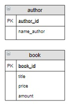
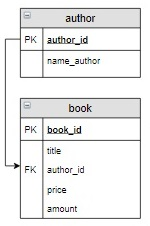
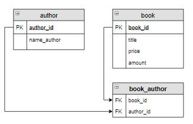
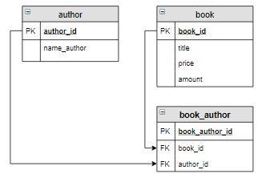

# Связь между таблицами

### Содержание
[Связь «один ко многим»](#T1)<br>
[Связь «многие ко многим»](#T2)<br>
[Создание таблицы с внешними ключами](#T3)<br>
[Действия при удалении записи главной таблицы](#T4)<br>

<br>

<a name="T1"></a>
# Связь «один ко многим»

Рассмотрим таблицу `book`(в ней столбец `author` переименован в `name_author`):

book_id | title | name_author | price | amount |
------  | ----- | ----------  | ----- | ------ |
1       | Мастер и Маргарита  | Булгаков М.А. | 670.99 | 3     |
2       | Белая гвардия      | Булгаков М.А. | 540.50 | 5     |

В этой таблице фамилии авторов повторяются для нескольких книг. А что, если придется вместо инициалов для каждого автора хранить его полное имя и отчество? Тогда, если в таблице содержится информация о 50 книгах Достоевского, придется 50 раз исправлять «Ф.М.» на «Федор Михайлович». При этом, если в некоторых записях использовать «Фёдор Михайлович» (c буквой ё), то мы вообще получим двух разных авторов... 

Чтобы устранить эту проблему в реляционных базах данных создается новая таблица `author`,  в которой перечисляются все различные авторы, а затем эта таблица связывается с таблицей `book`. При этом такая связь называется «***один ко многим***», таблица `author` называется главной, таблица `book` – связанной или подчиненной. 

Связь «***один ко многим***» имеет место, когда одной записи главной таблицы соответствует несколько записей связанной таблицы, а каждой записи связанной таблицы соответствует только одна запись главной таблицы.

`Автор --> Книга`

Один автор может написать несколько книг, а одна книга написана только одним автором. Для каждой книги известны ее количество и цена.

<a name="S1"></a>
1. Создаем таблицу `author`,  в которую включаем уникальных авторов книг, хранящихся на складе:


<a name="S2"></a>
2. Обе таблицы должны содержать первичный ключ, в таблице  `book` он уже есть,  в таблицу `author` добавим ключ `author_id`:



3. Включаем в таблицу `book` связанный столбец (внешний ключ, `FOREIGN KEY`), соответствующий по имени и типу ключевому столбцу главной таблицы (в нашем случае это столбец `author_id`). На схеме обозначается стрелкой от ключевого столбца главной таблицы к внешнему ключу связной таблицы:



___
<br>

<a name="T2"></a>
# Связь «многие ко многим»

Например, книга «12 стульев» написана двумя авторами Ильфом И.А. и Петровым Е.П. Также эти авторы написали и другие книги, например «Золотой теленок».

Для соединения таких таблиц используется связь «***многие ко многим***».

Связь «многие ко многим» имеет место когда каждой записи одной таблицы соответствует несколько записей во второй, и наоборот, каждой записи второй таблицы соответствует несколько записей в первой.

`Автор <--> Книга`

Один автор может написать несколько книг, а одна книга может быть написана несколькими авторами. Для каждой книги известны ее количество и цена.

[1 - пункт](#S1)<br>
[2 - пункт](#S2)<br>

3. Создаем новую таблицу-связку, состоящую из двух столбцов, соответствующих по имени и типу ключевым столбцам исходных таблиц. Каждый из этих столбцов является внешним ключом (`FOREIGN KEY`)  и связан с ключевым столбцом каждой таблицы. Для наглядности связи на схеме обозначаются стрелкой от ключевого столбца исходной таблицы к внешнему ключу связной таблицы.



4. Дальше необходимо определиться с первичным ключом таблицы-связки. Можно в таблицу-связки включить дополнительные столбцы для идентификации записей, например, дату продажи, а также в таблицу-связки добавляют первичный ключ, чем мы и воспользуемся.



___
<br>


<a name="T3"></a>
# Создание таблицы с внешними ключами

При создании зависимой таблицы необходимо учитывать, что :

+ каждый внешний ключ должен иметь такой же тип данных, как связанное поле главной таблицы;
+ необходимо указать главную для нее таблицу и столбец, по которому осуществляется связь:

```
FOREIGN KEY (связанное_поле_зависимой_таблицы)  
REFERENCES главная_таблица (связанное_поле_главной_таблицы)
```

По умолчанию любой столбец, кроме ключевого, может содержать значение `NULL`. При создании таблицы это можно переопределить, используя ограничение `NOT NULL` для этого столбца:

```sql
CREATE TABLE таблица (
    столбец_1 INT NOT NULL, 
    столбец_2 VARCHAR(10) 
);
```

Для внешних ключей рекомендуется устанавливать ограничение `NOT NULL` (если это совместимо с другими опциями, которые будут рассмотрены в следующем шаге).

### **Пример**

Создать таблицу `book` следующей структуры:

Поле | Тип, описание | Связи
---- | ------------  | ----
book_id | INT PRIMARY KEY AUTO_INCREMENT|	 
title | VARCHAR(50)|
author_id | INT | внешний ключ: главная таблица author, <br>связанный столбец author.author_id, пустое значение не допускается
price | DECIMAL(8, 2) |	 
amount | INT |	 

```sql
CREATE TABLE book (
    book_id INT PRIMARY KEY AUTO_INCREMENT, 
    title VARCHAR(50), 
    author_id INT NOT NULL, 
    price DECIMAL(8,2), 
    amount INT, 
    FOREIGN KEY (author_id)  REFERENCES author (author_id) 
);
```
___
<br>

<a name="T4"></a>
# Действия при удалении записи главной таблицы

С помощью выражения `ON DELETE` можно установить действия, которые выполняются для записей подчиненной таблицы при удалении связанной строки из главной таблицы. При удалении можно установить следующие опции:

+ `CASCADE`: автоматически удаляет строки из зависимой таблицы при удалении  связанных строк в главной таблице.
+ `SET NULL`: при удалении  связанной строки из главной таблицы устанавливает для столбца внешнего ключа значение `NULL`. (В этом случае столбец внешнего ключа должен поддерживать установку `NULL`).
+ `SET DEFAULT` похоже на `SET NULL` за тем исключением, что значение  внешнего ключа устанавливается в значение по умолчанию для данного столбца, а не в `NULL`.
+ `RESTRICT`: отклоняет удаление строк в главной таблице при наличии связанных строк в зависимой таблице.

> Важно! Если для столбца установлена опция SET NULL, то при его описании нельзя задать ограничение на пустое значение

### **Пример**

При удалении автора из таблицы `author`, необходимо удалить все записи о книгах из таблицы `book`, написанные этим автором. А при удалении жанра из таблицы `genre` для соответствующей записи `book` установить значение `Null` в столбце `genre_id`. Данное действие необходимо прописать при создании таблицы.

```sql
CREATE TABLE book (
    book_id INT PRIMARY KEY AUTO_INCREMENT, 
    title VARCHAR(50), 
    author_id INT NOT NULL,
    genre_id INT,
    price DECIMAL(8,2), 
    amount INT, 
    FOREIGN KEY (author_id)  REFERENCES author (author_id) ON DELETE CASCADE,
    FOREIGN KEY (genre_id)  REFERENCES genre (genre_id) ON DELETE SET NULL
);
```
___
<br>
