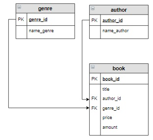
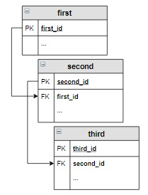
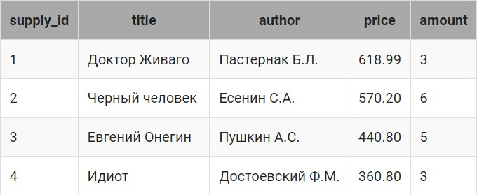

# Запросы на выборку, соединение таблиц

### Содержание
[Соединение INNER JOIN](#T1)<br>
[Внешнее соединение LEFT и RIGHT OUTER JOIN](#T2)<br>
[Перекрестное соединение CROSS JOIN](#T3)<br>
[Запросы на выборку из нескольких таблиц](#T4)<br>
[Запросы для нескольких таблиц с группировкой](#T5)<br>
[Запросы для нескольких таблиц со вложенными запросами](#T6)<br>
[Вложенные запросы в операторах соединения](#T7)<br>
[Операция соединение, использование USING()](#T8)<br>

<br>

Операция соединения `JOIN` предназначена для обеспечения выборки данных из двух таблиц и включения этих данных в один результирующий набор. При необходимости соединения не двух, а нескольких таблиц, операция соединения применяется несколько раз (последовательно).

Операторы соединения входят в раздел `FROM` SQL запросов.

**Логическая схема базы данных:**


<br>

<a name="T1"></a>
# Соединение INNER JOIN

Оператор внутреннего соединения `INNER JOIN` соединяет две таблицы. Порядок таблиц для оператора неважен, поскольку оператор является симметричным.

```SQL
SELECT
 ...
FROM
    таблица_1 INNER JOIN  таблица_2
    ON условие
...
```

### **Пример**

Вывести название книг и их авторов.

```sql
SELECT title, name_author
FROM 
    author INNER JOIN book
    ON author.author_id = book.author_id;

--ркзультат
+-----------------------+------------------+
| title                 | name_author      |
+-----------------------+------------------+
| Мастер и Маргарита    | Булгаков М.А.    |
| Белая гвардия         | Булгаков М.А.    |
| Идиот                 | Достоевский Ф.М. |
| Братья Карамазовы     | Достоевский Ф.М. |
| Игрок                 | Достоевский Ф.М. |
| Стихотворения и поэмы | Есенин С.А.      |
| Черный человек        | Есенин С.А.      |
| Лирика                | Пастернак Б.Л.   |
+-----------------------+------------------+
```
Поскольку поля `author_id` в таблицах `book` и `author` называются одинаково, необходимо в запросах указывать полную ссылку на них (`book.author_id` и `author.author_id`).

В результирующую таблицу запроса включаются все строки, в которых значения этих столбцов совпадают.

### **Пример**

 Вывести название, жанр и цену тех книг, количество которых больше 8, в отсортированном по убыванию цены виде.

```sql
SELECT title, name_genre, price
FROM genre INNER JOIN book
    ON genre.genre_id = book.genre_id AND
    amount > 8
ORDER BY 3 DESC;

--результат
+-----------------------+------------+--------+
| title                 | name_genre | price  |
+-----------------------+------------+--------+
| Стихотворения и поэмы | Поэзия     | 650.00 |
| Игрок                 | Роман      | 480.50 |
| Идиот                 | Роман      | 460.00 |
+-----------------------+------------+--------+
```
___
<br>

<a name="T2"></a> 
# Внешнее соединение LEFT и RIGHT OUTER JOIN

Оператор внешнего соединения `LEFT OUTER JOIN`  (можно использовать `LEFT JOIN`) соединяет две таблицы. Порядок таблиц для оператора важен, поскольку оператор не является симметричным.

```sql
SELECT
 ...
FROM
    таблица_1 LEFT JOIN  таблица_2
    ON условие
...
```

1. в результат включается внутреннее соединение (`INNER JOIN`) первой и второй таблицы в соответствии с условием;
2. затем в результат добавляются невошедшие записи первой таблицы во внутреннем соединение на шаге 1, для таких записей соответствующие поля второй таблицы заполняются значениями `NULL`.

Соединение `RIGHT JOIN` действует аналогично, только в пункте 2 первая таблица меняется на вторую и наоборот.

### **Пример**

Вывести название всех книг каждого автора, если книг некоторых авторов в данный момент нет на складе – вместо названия книги указать `Null`.

```sql
SELECT name_author, title 
FROM author LEFT JOIN book
     ON author.author_id = book.author_id
ORDER BY name_author;   

-- результат

+------------------+-----------------------+
| name_author      | title                 |
+------------------+-----------------------+
| Булгаков М.А.    | Мастер и Маргарита    |
| Булгаков М.А.    | Белая гвардия         |
| Достоевский Ф.М. | Игрок                 |
| Достоевский Ф.М. | Идиот                 |
| Достоевский Ф.М. | Братья Карамазовы     |
| Есенин С.А.      | Стихотворения и поэмы |
| Есенин С.А.      | Черный человек        |
| Лермонтов М.Ю.   | NULL                  |
| Пастернак Б.Л.   | Лирика                |
+------------------+-----------------------+
```

### **Пример**

Вывести все жанры, которые не представлены в книгах на складе.

```sql
SELECT name_genre
FROM genre g LEFT JOIN book b
    ON g.genre_id = b.genre_id
WHERE title IS NULL;

--результат

+-------------+
| name_genre  |
+-------------+
| Приключения |
+-------------+
```
___
<br>

<a name=T3></a>
# Перекрестное соединение CROSS JOIN

Оператор перекрёстного соединения, или декартова произведения `CROSS JOIN` (в запросе вместо ключевых слов можно поставить запятую между таблицами) соединяет две таблицы. Порядок таблиц для оператора неважен, поскольку оператор является симметричным. Его структура:

```sql
SELECT
 ...
FROM
    таблица_1 CROSS JOIN  таблица_2  --таблица_1, таблица_2
...
```

Результат запроса формируется так: каждая строка одной таблицы соединяется с каждой строкой другой таблицы, формируя  в результате все возможные сочетания строк двух таблиц.

### **Пример**

каждому автору из таблицы `author` поставит в соответствие все возможные жанры из таблицы `genre`:

```sql
SELECT name_author, name_genre
FROM 
    author, genre;

--результат

+------------------+-------------+
| name_author      | name_genre  |
+------------------+-------------+
| Булгаков М.А.    | Роман       |
| Булгаков М.А.    | Поэзия      |
| Булгаков М.А.    | Приключения |
| Достоевский Ф.М. | Роман       |
| Достоевский Ф.М. | Поэзия      |
| Достоевский Ф.М. | Приключения |
| Есенин С.А.      | Роман       |
...
+------------------+-------------+
```

### **Пример**

Необходимо в каждом городе провести выставку книг каждого автора в течение 2020 года. Дату проведения выставки выбрать случайным образом. Создать запрос, который выведет город, автора и дату проведения выставки (Дата). Информацию вывести, отсортировав сначала в алфавитном порядке по названиям городов, а потом по убыванию дат проведения выставок.

```sql
SELECT name_city, name_author, 
    DATE_ADD('2020-01-01', INTERVAL RAND()*365 DAY) AS Дата
FROM city CROSS JOIN author
ORDER BY 1, 3 DESC;

--результат

+-----------------+------------------+------------+
| name_city       | name_author      | Дата       |
+-----------------+------------------+------------+
| Владивосток     | Достоевский Ф.М. | 2020-11-16 |
| Владивосток     | Лермонтов М.Ю.   | 2020-10-19 |
| Владивосток     | Пастернак Б.Л.   | 2020-06-17 |
| Владивосток     | Есенин С.А.      | 2020-02-25 |
| Владивосток     | Булгаков М.А.    | 2020-01-26 |
| Москва          | Есенин С.А.      | 2020-11-22 |
...
```
___
<br>

<a name="T4"></a>
# Запросы на выборку из нескольких таблиц

Запрос на выборку может выбирать данные из двух и более таблиц базы данных. При этом таблицы должны быть логически связаны между собой. Для каждой пары таблиц, включаемых в запрос, необходимо указать свой оператор соединения. Наиболее распространенным является внутреннее соединение `INNER JOIN`.

Пусть таблицы связаны между собой следующим образом:



тогда запрос на выборку будет иметь вид:

```sql
SELECT
 ...
FROM
    first 
    INNER JOIN  second ON first.first_id = second.first_id
    INNER JOIN  third  ON second.second_id = third.second_id
...
```
Если же таблицы связаны так:


```sql
SELECT
 ...
FROM
    first 
    INNER JOIN  third ON first.first_id = third.first_id
    INNER JOIN second ON third.second_id = second.second_id 
...
```
В этом случае рекомендуется соединение таблиц записывать последовательно, «по кругу»: `first → third → second`.

### **Пример**

Вывести информацию о тех книгах, их авторах и жанрах, цена которых принадлежит интервалу от 500  до 700 рублей  включительно.

```sql
SELECT title, name_author, name_genre, price, amount
FROM
    author 
    INNER JOIN  book ON author.author_id = book.author_id
    INNER JOIN genre ON genre.genre_id = book.genre_id
WHERE price BETWEEN 500 AND 700;

--результат
+-----------------------+----------------+------------+--------+--------+
| title                 | name_author    | name_genre | price  | amount |
+-----------------------+----------------+------------+--------+--------+
| Мастер и Маргарита    | Булгаков М.А.  | Роман      | 670.99 | 3      |
| Белая гвардия         | Булгаков М.А.  | Роман      | 540.50 | 5      |
| Стихотворения и поэмы | Есенин С.А.    | Поэзия     | 650.00 | 15     |
| Черный человек        | Есенин С.А.    | Поэзия     | 570.20 | 6      |
| Лирика                | Пастернак Б.Л. | Поэзия     | 518.99 | 2      |
+-----------------------+----------------+------------+--------+--------+
```

### **Пример**

Вывести информацию о книгах (жанр, книга, автор), относящихся к жанру, включающему слово «роман» в отсортированном по названиям книг виде.

```sql
SELECT name_genre, title, name_author
FROM author a
    INNER JOIN book b ON a.author_id = b.author_id
    INNER JOIN genre g ON g.genre_id = b.genre_id
WHERE name_genre LIKE '%роман%'
ORDER BY title;

--результат
+------------+--------------------+------------------+
| name_genre | title              | name_author      |
+------------+--------------------+------------------+
| Роман      | Белая гвардия      | Булгаков М.А.    |
| Роман      | Братья Карамазовы  | Достоевский Ф.М. |
| Роман      | Игрок              | Достоевский Ф.М. |
| Роман      | Идиот              | Достоевский Ф.М. |
| Роман      | Мастер и Маргарита | Булгаков М.А.    |
+------------+--------------------+------------------+
```
___
<br>

<a name="T5"></a>
# Запросы для нескольких таблиц с группировкой

В запросах с групповыми функциями могут использоваться несколько таблиц, между которыми используются различные типы соединений.

### **Пример**

Вывести количество различных книг каждого автора. Информацию отсортировать в алфавитном порядке по фамилиям  авторов.

```sql
SELECT name_author, count(title) AS Количество
FROM 
    author INNER JOIN book
    on author.author_id = book.author_id
GROUP BY name_author
ORDER BY name_author;

-- результат
+------------------+------------+
| name_author      | Количество |
+------------------+------------+
| Булгаков М.А.    | 2          |
| Достоевский Ф.М. | 3          |
| Есенин С.А.      | 2          |
| Пастернак Б.Л.   | 1          |
+------------------+------------+
```

При использовании соединения `INNER JOIN` мы не можем узнать, что книг Лермонтова на складе нет, но предполагается, что они могут быть.  Чтобы автор Лермонтов был включен в результат, нужно изменить соединение таблиц.

```sql
SELECT name_author, count(title) AS Количество
FROM 
    author LEFT JOIN book
    on author.author_id = book.author_id
GROUP BY name_author
ORDER BY name_author;  

-- результат
+------------------+------------+
| name_author      | Количество |
+------------------+------------+
| Булгаков М.А.    | 2          |
| Достоевский Ф.М. | 3          |
| Есенин С.А.      | 2          |
| Лермонтов М.Ю.   | 0          |
| Пастернак Б.Л.   | 1          |
+------------------+------------+
```
___
<br>

<a name="T6"></a>
# Запросы для нескольких таблиц со вложенными запросами

В запросах, построенных на нескольких таблицах, можно использовать вложенные запросы. Вложенный запрос может быть включен:  после ключевого слова `SELECT`,  после `FROM` и в условие отбора после `WHERE (HAVING)`.

### **Пример**

Вывести авторов, общее количество книг которых на складе максимально.

Это достаточно сложный запрос, поэтому будем решать его по шагам (реализуя каждый запрос по отдельности), а потом объединим все запросы в один.

1. Найдем суммарное количество книг на складе по каждому автору. Поскольку фамилии автора в этой таблице нет, то группировку будем осуществлять по `author_id`.

```sql
SELECT author_id, SUM(amount) AS sum_amount FROM book GROUP BY author_id

+-----------+------------+
| author_id | sum_amount |
+-----------+------------+
| 1         | 8          |
| 2         | 23         |
| 3         | 21         |
| 4         | 2          |
+-----------+------------+
```

2. В результирующей таблице предыдущего запроса необходимо найти максимальное значение, то есть 23. Для этого запросу, созданному на шаге 1, необходимо присвоить имя (например, `query_in`) и использовать его в качестве таблицы-источника после FROM. Затем уже находить максимум по столбцу `sum_amount`.

```sql
SELECT MAX(sum_amount) AS max_sum_amount
FROM 
    (
     SELECT author_id, SUM(amount) AS sum_amount 
     FROM book 
     GROUP BY author_id
    ) query_in

+----------------+
| max_sum_amount |
+----------------+
| 23             |
+----------------+
```

3. Выведем фамилию автора и общее количество книг для него.

```sql
SELECT name_author, SUM(amount) as Количество
FROM 
    author INNER JOIN book
    on author.author_id = book.author_id
GROUP BY name_author

+------------------+------------+
| name_author      | Количество |
+------------------+------------+
| Булгаков М.А.    | 8          |
| Достоевский Ф.М. | 23         |
| Есенин С.А.      | 21         |
| Пастернак Б.Л.   | 2          |
+------------------+------------+
```

4.  Включим запрос с шага 2 в условие отбора запроса с шага 3. И получим всех авторов, общее количество книг которых максимально.

```sql
SELECT name_author, SUM(amount) as Количество
FROM 
    author INNER JOIN book
    on author.author_id = book.author_id
GROUP BY name_author
HAVING SUM(amount) = 
     (/* вычисляем максимальное из общего количества книг каждого автора */
      SELECT MAX(sum_amount) AS max_sum_amount
      FROM 
          (/* считаем количество книг каждого автора */
            SELECT author_id, SUM(amount) AS sum_amount 
            FROM book GROUP BY author_id
          ) query_in
      );

+------------------+------------+
| name_author      | Количество |
+------------------+------------+
| Достоевский Ф.М. | 23         |
+------------------+------------+
```
<br>

<a name="T7"></a>
# Вложенные запросы в операторах соединения

Вложенные запросы могут использоваться в операторах соединения `JOIN`.  При этом им необходимо присваивать имя, которое записывается сразу после закрывающей скобки вложенного запроса.

```sql
SELECT
 ...
FROM
    таблица ... JOIN  
       (
        SELECT ...
       ) имя_вложенного_запроса
    ON условие
...
```
Вложенный запрос может стоять как справа, так и слева от оператора `JOIN`. Допускается использование двух запросов в операторах соединения.

Вывести информацию о книгах (название книги, фамилию и инициалы автора, название жанра, цену и количество экземпляров книги), написанных в самых популярных жанрах, в отсортированном в алфавитном порядке по названию книг. Самым популярный - жанр, общее количество экземпляров книг которого на складе максимальное.

Рассмотрим реализацию этого запроса по шагам.

1. Найдем общее количество книг по каждому жанру (самый популярный жанр), отсортируем его по убыванию и ограничим вывод одной строкой.

```sql
SELECT genre_id, SUM(amount) AS sum_amount
FROM book
GROUP BY genre_id
ORDER BY sum_amount DESC
LIMIT 1

+---------------+------------+
|  genre_id     | sum_amount |
+---------------+------------+
| 1             | 31         |
+---------------+------------+
```

Поскольку несколько жанров могут иметь одинаковую популярность. Нам необходим запрос, который отберет ВСЕ жанры, суммарное количество книг которых равно `sum_amount`.

2. Используя запрос с предыдущего шага, найдем `id` самых популярных жанров.

```sql
SELECT query_in_1.genre_id
    FROM ( -- выбираем код жанра и количество произведений, относящихся к нему
        SELECT genre_id, SUM(amount) AS sum_amount
        FROM book
        GROUP BY genre_id
        ) query_in_1
        INNER JOIN (  -- выбираем запись, в которой указан код жанр с максимальным количеством книг
            SELECT genre_id, SUM(amount) AS sum_amount
            FROM book
            GROUP BY genre_id
            ORDER BY sum_amount DESC
            LIMIT 1
            ) query_in_2
        ON query_in_1.sum_amount= query_in_2.sum_amount;

+----------+
| genre_id |
+----------+
| 1        |
| 2        |
+----------+
```

3. Используя запрос с шага 2, выведем инфо. книг, которые пишут в самых популярных жанрах. В этом запросе обязательно выполнить группировку по название книги, фамилии, название жанра, цену, количество экземпляров книги и id жанров, так как без этого инфо. книг будут повторяться, поскольку в таблице book есть разные книги, написанные в одном жанре и авторами.


```sql
SELECT title, name_author, name_genre, price, amount
FROM author a
    INNER JOIN book b ON a.author_id = b.author_id
    INNER JOIN genre g ON b.genre_id = g.genre_id
GROUP BY title, name_author, name_genre, price, amount, g.genre_id
HAVING g.genre_id IN ( -- выбираем инфо. книг, написанных в самых популярных жанрах
          SELECT query_in_1.genre_id
          FROM ( -- выбираем код жанра и количество произведений, относящихся к нему */
              SELECT genre_id, SUM(amount) AS sum_amount
              FROM book
              GROUP BY genre_id 
              ) AS query_in_1
              INNER JOIN ( -- выбираем запись, в которой указан код жанр с максимальным количеством книг
                  SELECT genre_id, SUM(amount) AS sum_amount
                  FROM book
                  GROUP BY genre_id
                  ORDER BY sum_amount DESC
                  LIMIT 1
              ) AS query_in_2
              ON query_in_1.sum_amount = query_in_2.sum_amount 
          )
ORDER BY 1;

+-----------------------+------------------+------------+--------+--------+
| title                 | name_author      | name_genre | price  | amount |
+-----------------------+------------------+------------+--------+--------+
| Белая гвардия         | Булгаков М.А.    | Роман      | 540.50 | 5      |
| Братья Карамазовы     | Достоевский Ф.М. | Роман      | 799.01 | 3      |
| Игрок                 | Достоевский Ф.М. | Роман      | 480.50 | 10     |
...
+-----------------------+------------------+------------+--------+--------+
```
___
<br>

<a name="T8"></a>
# Операция соединение, использование USING()

`USING` позволяет указать набор столбцов, которые есть в обеих объединяемых таблицах. Если база данных хорошо спроектирована, а каждый внешний ключ имеет такое же имя, как и соответствующий первичный ключ (например, `genre.genre_id = book.genre_id`), тогда можно использовать предложение `USING` для реализации операции `JOIN`. 

При использовании столбцов из `USING()`, необязательно указывать, из какой именно таблицы берется столбец.

### Пример

```sql
-- Вариант с ON

SELECT title, name_author, author.author_id
FROM 
    author INNER JOIN book
    ON author.author_id = book.author_id;

-- Вариант с USING

SELECT title, name_author, author_id
FROM 
    author INNER JOIN book
    USING(author_id);
```

Запись условия соединения с `ON` является более общим случаем, так как:
+ позволяет задавать соединение не только по одноименным полям;
+ позволяет использовать произвольное условие на соединение таблиц, при этом в условие может включаться произвольное выражение, например, можно указать связь двух таблиц по двум и более столбцам.

### Пример

В таблице `supply` занесена информация о книгах, поступивших на склад.



Если в таблицах `supply` и `book` есть одинаковые книги, вывести их название и автора. При этом учесть, что у нескольких авторов могут быть книги с одинаковым названием.

> Важно! В данном примере для соединения `book` и `supply` использовать `USING` нельзя, так как: 
> + в таблице `book` фамилий авторов вообще нет (их необходимо получить из таблицы `author`, столбец `name_author`),  а в таблице `supply` фамилии занесены в столбец `author`;
> + для однозначной идентификации книги нужно указать, что совпадают не только названия, но и авторы книг.

```sql
SELECT book.title, name_author
FROM 
    author 
    INNER JOIN book USING (author_id)   
    INNER JOIN supply ON book.title = supply.title 
                        AND author.name_author = supply.author;
```

```sql
SELECT b.title AS Название, name_author AS Автор, b.amount + s.amount  AS Количество
FROM author a
    INNER JOIN book b USING(author_id)
    INNER JOIN supply s USING(title, price) -- ON b.title = s.title AND b.price = s.price

+----------------+-------------+------------+
| Название       | Автор       | Количество |
+----------------+-------------+------------+
| Черный человек | Есенин С.А. | 12         |
+----------------+-------------+------------+
```
___