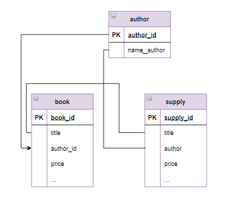

# Запросы корректировки, соединение таблиц

### Содержание
[Запросы на обновление, связанные таблицы](#T1)<br>
[Запросы на добавление, связанные таблицы](#T2)<br>
[Запрос на обновление, вложенные запросы](#T3)<br>
[Каскадное удаление записей связанных таблиц](#T4)<br>
[Удаление записей главной таблицы с сохранением записей в зависимой](#T5)<br>
[Удаление записей, использование связанных таблиц](#T6)<br>

<br>

В запросах на обновление можно использовать связанные таблицы:

```sql
UPDATE таблица_1
     ... JOIN таблица_2
     ON выражение
     ...
SET ...   
WHERE ...;
```

При этом исправлять данные можно во всех используемых в запросе таблицах.

### **Пример**

Для книг, которые уже есть на складе (в таблице `book`) по той же цене, что и в поставке (`supply`), увеличить количество на значение, указанное в поставке, а также обнулить количество этих книг в поставке.

Этот запрос должен отобрать строки из таблиц `bookи supply` такие, что у них совпадают и автор, и название книги. Но в таблице `supply` фамилия автора записана не числом (id), а текстом. Следовательно, чтобы выполнить сравнение по фамилии автора нужно "подтянуть" таблицу `author`,  которая связана с `book` по столбцу `author_id`.  И в логическом выражении, описывающем соединение таблиц, можно будет использовать столбцы из таблиц `book`, `author` и `supply`. 

Если таблицы логически связаны по двум и более столбцам (на рисунке связи обозначены линиями), возможно через другие таблицы, условие соединение будет включать связи по нужным столбцам через логический оператор `AND`. Например, для следующих таблиц логическую связь по названию и автору:



```sql
UPDATE book         -- условие соединения
     INNER JOIN author ON author.author_id = book.author_id
     INNER JOIN supply ON book.title = supply.title 
                         and supply.author = author.name_author
SET book.amount = book.amount + supply.amount,
    supply.amount = 0   
WHERE book.price = supply.price;

SELECT * FROM book;
SELECT * FROM supply;

+---------+-----------------------+-----------+----------+--------+--------+
| book_id | title                 | author_id | genre_id | price  | amount |
+---------+-----------------------+-----------+----------+--------+--------+
| 1       | Мастер и Маргарита    | 1         | 1        | 670.99 | 3      |
| 2       | Белая гвардия         | 1         | 1        | 540.50 | 12     |
| 3       | Идиот                 | 2         | 1        | 460.00 | 10     |
| 4       | Братья Карамазовы     | 2         | 1        | 799.01 | 3      |
| 5       | Игрок                 | 2         | 1        | 480.50 | 10     |
| 6       | Стихотворения и поэмы | 3         | 2        | 650.00 | 15     |
| 7       | Черный человек        | 3         | 2        | 570.20 | 12     |
| 8       | Лирика                | 4         | 2        | 518.99 | 2      |
+---------+-----------------------+-----------+----------+--------+--------+

+-----------+-----------------------+------------------+--------+--------+
| supply_id | title                 | author           | price  | amount |
+-----------+-----------------------+------------------+--------+--------+
| 1         | Доктор Живаго         | Пастернак Б.Л.   | 380.80 | 4      |
| 2         | Черный человек        | Есенин С.А.      | 570.20 | 0      |
| 3         | Белая гвардия         | Булгаков М.А.    | 540.50 | 0      |
| 4         | Идиот                 | Достоевский Ф.М. | 360.80 | 3      |
| 5         | Стихотворения и поэмы | Лермонтов М.Ю.   | 255.90 | 4      |
| 6         | Остров сокровищ       | Стивенсон Р.Л.   | 599.99 | 5      |
+-----------+-----------------------+------------------+--------+--------+
```
Под нужное нам условие подходят две книги «Белая гвардия» Булгакова и «Черный человек» Есенина. В таблице `book` их количество увеличилось, а в таблице `supply` - обнулилось.
___
<br>

<a name="T2"></a>
# Запросы на добавление, связанные таблицы

```sql
INSERT INTO таблица (список_полей)
SELECT список_полей_из_других_таблиц
FROM 
    таблица_1 
    ... JOIN таблица_2 ON ...
    ...
```

### **Пример**

В таблице `supply`  есть новые книги, которых на складе еще не было. Прежде чем добавлять их в таблицу `book`,  необходимо из таблицы `supply` отобрать новых авторов, если таковые имеются.

```sql
SELECT name_author, supply.author
FROM 
    author 
    RIGHT JOIN supply ON author.name_author = supply.author;

+------------------+------------------+
| name_author      | author           |
+------------------+------------------+
| Булгаков М.А.    | Булгаков М.А.    |
| Достоевский Ф.М. | Достоевский Ф.М. |
| Есенин С.А.      | Есенин С.А.      |
| Пастернак Б.Л.   | Пастернак Б.Л.   |
| Лермонтов М.Ю.   | Лермонтов М.Ю.   |
| None             | Стивенсон Р.Л.   |
+------------------+------------------+
```

Выполнив правое внутреннее соединение таблиц, получили значение `Null (None)`, которого нет в таблице `author`.

Теперь достаточно в запросе задать условие отбора, и список новых авторов готов для включения в таблицу `author`.

```sql
SELECT supply.author
FROM 
    author 
    RIGHT JOIN supply on author.name_author = supply.author
WHERE name_author IS Null;

+----------------+
| author         |
+----------------+
| Стивенсон Р.Л. |
+----------------+
```

Включить новых авторов в таблицу `author` с помощью запроса на добавление, а затем вывести все данные из таблицы `author`.

```sql
INSERT INTO author (name_author)
SELECT s.author
FROM author a
    RIGHT JOIN supply s ON a.name_author = s.author
WHERE name_author IS NULL;

SELECT * FROM author;

+-----------+------------------+
| author_id | name_author      |
+-----------+------------------+
| 1         | Булгаков М.А.    |
| 2         | Достоевский Ф.М. |
| 3         | Есенин С.А.      |
| 4         | Пастернак Б.Л.   |
| 5         | Лермонтов М.Ю.   |
| 6         | Стивенсон Р.Л.   |
+-----------+------------------+
```
___
<br>

Следующий шаг - добавить новые записи о книгах, которые есть в таблице `supply` и нет в таблице `book`. (В таблицах `supply` и `book` сохранены изменения предыдущих шагов). Поскольку в таблице `supply` не указан жанр книги, оставить его пока пустым.

### **Пример**

Прежде всего необходимо сформировать запрос с полями, которые соответствуют полям таблицы `book`, так как использовать только таблицу `supply` нельзя - в ней вместо кода автора стоит его фамилия. 

```sql
SELECT title, author_id, price, amount
FROM 
    author 
    INNER JOIN supply ON author.name_author = supply.author;

+-----------------------+-----------+--------+--------+
| title                 | author_id | price  | amount |
+-----------------------+-----------+--------+--------+
| Доктор Живаго         | 4         | 380.80 | 4      |
| Черный человек        | 3         | 570.20 | 0      |
| Белая гвардия         | 1         | 540.50 | 0      |
| Идиот                 | 2         | 360.80 | 0      |
| Стихотворения и поэмы | 5         | 255.90 | 4      |
| Остров сокровищ       | 6         | 599.99 | 5      |
+-----------------------+-----------+--------+--------+
```

Далее необходимо отобрать только новые книги из таблицы `supply`. Как видно из таблицы с результатами запроса, в тех записях, которые нужно добавить, значения столбца `amount` не равны 0 (количество уже учтенных книг обнулены предыдущим запросом). Добавим это условие в запрос.

```sql
SELECT title, author_id, price, amount
FROM 
    author 
    INNER JOIN supply ON author.name_author = supply.author
WHERE amount <> 0;

+-----------------------+-----------+--------+--------+
| title                 | author_id | price  | amount |
+-----------------------+-----------+--------+--------+
| Доктор Живаго         | 4         | 380.80 | 4      |
| Стихотворения и поэмы | 5         | 255.90 | 4      |
| Остров сокровищ       | 6         | 599.99 | 5      |
+-----------------------+-----------+--------+--------+
```

Добавляем новые книги из таблицы `supply` в таблицу `book` на основе сформированного выше запроса.

```sql
INSERT book (title, author_id, price, amount)
SELECT title, author_id, price, amount
FROM author
    INNER JOIN supply ON name_author = author
WHERE amount <> 0;
```
___
<br>

<a name="T3"></a>
# Запрос на обновление, вложенные запросы

После того, как новые книги добавлены в таблицу `book`, нужно указать к какому жанру они относятся. Для этого используется запрос на обновление.

### **Пример**

Задать для книги Пастернака «Доктор Живаго»  жанр «Роман».

Если мы знаем код этой книги в таблице `book` (в нашем случае это 9) и код жанра «Роман» в таблице genre (это 1), запрос будет очень простым.

```sql
UPDATE book
SET genre_id = 1
WHERE book_id = 9;

SELECT * FROM book;

+---------+-----------------------+-----------+----------+--------+--------+
| book_id | title                 | author_id | genre_id | price  | amount |
+---------+-----------------------+-----------+----------+--------+--------+
...
| 9       | Доктор Живаго         | 4         | 1        | 380.80 | 4      |
| 10      | Стихотворения и поэмы | 5         | NULL     | 255.90 | 4      |
| 11      | Остров сокровищ       | 6         | NULL     | 599.99 | 5      |
+---------+-----------------------+-----------+----------+--------+--------+
```

Более сложным будет запрос, если известно только название жанра (результат будет точно таким же):

```sql
UPDATE book
SET genre_id = 
      (
       SELECT genre_id 
       FROM genre 
       WHERE name_genre = 'Роман'
      )
WHERE book_id = 9;

SELECT * FROM book;
```

 Занести для книги «Стихотворения и поэмы» Лермонтова жанр «Поэзия», а для книги «Остров сокровищ» Стивенсона - «Приключения».

 ```sql
 UPDATE book
SET genre_id = (SELECT genre_id
                FROM genre
                WHERE name_genre = "Поэзия"
                )
WHERE book_id = 10;

UPDATE book
SET genre_id = (SELECT genre_id
                FROM genre
                WHERE name_genre = "Приключения"
                )
WHERE book_id = 11;

SELECT * FROM book;

-- через CASE WHEN THEN
UPDATE book
SET genre_id =
    CASE
        WHEN book_id = 10 THEN (SELECT genre_id FROM genre WHERE name_genre = 'Поэзия')
        WHEN book_id = 11 THEN (SELECT genre_id FROM genre WHERE name_genre = 'Приключения')
        ELSE book.genre_id
    END;
```
___
<br>

<a name="T4"></a>
# Каскадное удаление записей связанных таблиц

При создании таблицы для внешних ключей с помощью `ON DELETE` [устанавливаются опции](https://github.com/EMIR1HUB/All_Conspectus/blob/main/SQL/2.1_base_ConnectionTables.md#T4), которые определяют действия , выполняемые при удалении связанной строки из главной таблицы.

В частности, `ON DELETE CASCADE` автоматически удаляет строки из зависимой таблицы при удалении  связанных строк в главной таблице.

В таблице `book` эта опция установлена для поля `author_id`.

### **Пример**

Удалим из таблицы `author` всех авторов, фамилия которых начинается на «Д», а из таблицы `book`  - все книги этих авторов.

```sql
DELETE FROM author
WHERE name_author LIKE "Д%";

SELECT * FROM author;
SELECT * FROM book;
```
Одним запросом удаляются связанные записи из главной и зависимой таблицы. В нашем случае удалился автор Достоевский и все его книги.

### **Пример**

Удалить всех авторов и все их книги, общее количество книг которых меньше 20.

```sql
DELETE FROM author
WHERE author_id IN (SELECT author_id
                    FROM book
                    GROUP BY author_id
                    HAVING SUM(amount) < 20
                    );
SELECT * FROM author;
SELECT * FROM book;

+-----------+------------------+
| author_id | name_author      |
+-----------+------------------+
| 2         | Достоевский Ф.М. |
| 3         | Есенин С.А.      |
+-----------+------------------+

+---------+-----------------------+-----------+----------+--------+--------+
| book_id | title                 | author_id | genre_id | price  | amount |
+---------+-----------------------+-----------+----------+--------+--------+
| 3       | Идиот                 | 2         | 1        | 437.11 | 13     |
| 4       | Братья Карамазовы     | 2         | 1        | 799.01 | 3      |
| 5       | Игрок                 | 2         | 1        | 480.50 | 10     |
| 6       | Стихотворения и поэмы | 3         | 2        | 650.00 | 15     |
| 7       | Черный человек        | 3         | 2        | 570.20 | 12     |
+---------+-----------------------+-----------+----------+--------+--------+
```
___
<br>

<a name="T5"></a>
# Удаление записей главной таблицы с сохранением записей в зависимой
При создании таблицы для внешних ключей с помощью `ON DELETE` [устанавливаются опции](https://github.com/EMIR1HUB/All_Conspectus/blob/main/SQL/2.1_base_ConnectionTables.md#T4), которые определяют действия , выполняемые при удалении связанной строки из главной таблицы.

Если задано `SET NULL`, то при удалении связанной строки из главной таблицы в зависимой, в столбце внешнего ключа, устанавливается значение `NULL`. (При этом в столбце внешнего ключа должно быть допустимо значение `NULL`)


### **Пример**

Удалим из таблицы `genre` все  жанры, название которых заканчиваются на «я» , а в таблице book  -  для этих жанров установим значение `Null`.

```sql
DELETE FROM genre
WHERE name_genre LIKE "%я";

SELECT * FROM genre;
SELECT * FROM book;
```

В нашем случае удалились жанры «Поэзия» и «Приключения».

### **Пример**

Удаляем все жанры, к которым относится меньше 4-х книг. В таблице `book` для этих жанров установить значение `Null`.

```sql
DELETE FROM genre
WHERE genre_id IN (SELECT genre_id
                   FROM book
                   GROUP BY genre_id
                   HAVING SUM(genre_id) < 4
                  );

SELECT * FROM author;
SELECT * FROM book;

-- второй способ
DELETE g FROM genre g
INNER JOIN (
    SELECT genre_id
    FROM book
    GROUP BY genre_id
    HAVING SUM(genre_id) < 4
    ) b
ON g.genre_id = b.genre_id;
```
___
<br>

<a name="T6"></a>
# Удаление записей, использование связанных таблиц

При удалении записей из таблицы можно использовать информацию из других связанных с ней таблиц. В этом случае синтаксис запроса имеет вид:

```sql
DELETE FROM таблица_1
USING 
    таблица_1 
    INNER JOIN таблица_2 ON ...
WHERE ...
```

### **Пример**

Удалить всех авторов из таблицы `author`, у которых есть книги, количество экземпляров которых меньше 3. Из таблицы book удалить все книги этих авторов.

```sql
DELETE FROM author
USING 
    author 
    INNER JOIN book ON author.author_id = book.author_id
WHERE book.amount < 3;

SELECT * FROM author;
SELECT * FROM book;
```
Книги из таблицы `book` будут удалены автоматически, так как для столбца `author_id` из таблицы `book` установлено каскадное удаление записей.

Удалить всех авторов, которые пишут в жанре "Поэзия". Из таблицы `book` удалить все книги этих авторов. В запросе для отбора авторов использовать полное название жанра, а не его `id`.

```sql
DELETE FROM author
USING author
    INNER JOIN book USING (author_id)
    INNER JOIN genre USING (genre_id)
WHERE name_genre = 'Поэзия';

SELECT * FROM author;
SELECT * FROM book;
```
___

