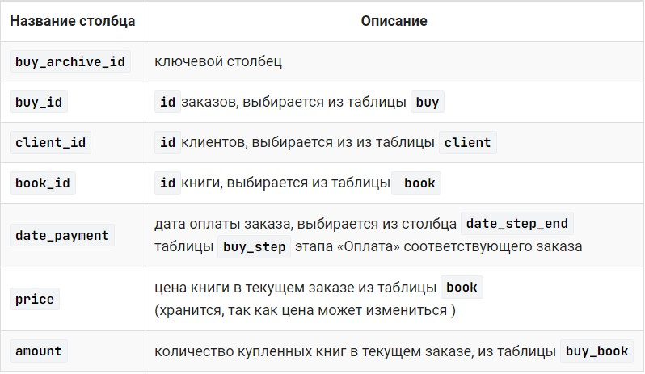

# База данных «Интернет-магазин книг», запросы на выборку

### Содержание
[​Логическая модель базы данных](#T1)<br>
[Запросы на основе трех и более связанных таблиц](#T2)<br>
[Оператор UNION](#T3)<br>

<br>


+ следующую пару таблиц:


+ реализуем связь «многие ко многим»:


+ В описании предметной области указывается, что нужно хранить количество книг, которые включены в заказ. Добавим эту характеристику в таблицу-связку `buy_book`:


___
<br>

<a name="T1"></a>
# Логическая модель базы данных


___
<br>


<a name="T2"></a>
# Запросы на основе трех и более связанных таблиц

### **Пример**

Вывести фамилии всех клиентов, которые заказали книгу Булгакова «Мастер и Маргарита».

Этот запрос строится на основе нескольких таблиц. В нашем случае выбираются название книги из таблицы `book` и фамилия клиента из таблицы `client`. Эти таблицы между собой непосредственно не связаны, поэтому нужно добавить «связующие» таблицы  `buy` и `buy_book`:

Для соединения этих таблиц используется `INNER JOIN`. Рекомендуется связи описывать последовательно: `client` → `buy` → `buy_book` → `book`.  А для соединения использовать пару **первичный ключ** и **внешний ключ** соответствующих таблиц. Например, соединение таблиц `client` и `buy` осуществляется по условию `client.client_id` = `buy.client_id`.

```sql
SELECT DISTINCT name_client
FROM 
    client 
    INNER JOIN buy ON client.client_id = buy.client_id
    INNER JOIN buy_book ON buy_book.buy_id = buy.buy_id
    INNER JOIN book ON buy_book.book_id=book.book_id
WHERE title ='Мастер и Маргарита' and author_id = 1;          

+---------------+
| name_client   |
+---------------+
| Баранов Павел |
| Абрамова Катя |
+---------------+
```

В запросе отбираются уникальные клиенты (`DISTINCT`) так как один и тот же клиент мог заказать одну и ту же книгу несколько раз.
<br>

### **Пример**

Посчитать, сколько раз была заказана каждая книга, для книги вывести ее автора (нужно посчитать, в каком количестве заказов фигурирует каждая книга).  Вывести фамилию и инициалы автора, название книги, последний столбец назвать `Количество`. Результат отсортировать сначала по фамилиям авторов, а потом по названиям книг.

```sql
SELECT name_author, title, COUNT(bb.amount) AS Количество
FROM author
    CROSS JOIN book b USING(author_id)
    LEFT JOIN buy_book bb USING(book_id)
GROUP BY name_author, title
ORDER BY name_author, title

+------------------+-----------------------+------------+
| name_author      | title                 | Количество |
+------------------+-----------------------+------------+
| Булгаков М.А.    | Белая гвардия         | 1          |
| Булгаков М.А.    | Мастер и Маргарита    | 2          |
| Достоевский Ф.М. | Братья Карамазовы     | 0          |
| Достоевский Ф.М. | Игрок                 | 1          |
| Достоевский Ф.М. | Идиот                 | 2          |
| Есенин С.А.      | Стихотворения и поэмы | 0          |
| Есенин С.А.      | Черный человек        | 1          |
| Пастернак Б.Л.   | Лирика                | 1          |
+------------------+-----------------------+------------+
```
<br>

### **Пример**
Вывести номера всех оплаченных заказов и даты, когда они были оплачены.

```sql
SELECT buy_id, date_step_end
FROM buy_step
    JOIN step USING(step_id)
WHERE step_id = 1 AND date_step_end IS NOT NULL

+--------+---------------+
| buy_id | date_step_end |
+--------+---------------+
| 1      | 2020-02-20    |
| 2      | 2020-02-28    |
| 3      | 2020-03-05    |
+--------+---------------+
```
<br>

### **Пример**
В таблице `city` для каждого города указано количество дней, за которые заказ может быть доставлен в этот город (рассматривается только этап **Транспортировка**). Для тех заказов, которые прошли этап транспортировки, вывести количество дней за которое заказ реально доставлен в город. А также, если заказ доставлен с опозданием, указать количество дней задержки, в противном случае вывести 0. В результат включить номер заказа (`buy_id`), а также вычисляемые столбцы `Количество_дней` и `Опоздание`. Информацию вывести в отсортированном по номеру заказа виде.

```sql
SELECT buy_id, 
    DATEDIFF(date_step_end,date_step_beg) AS Количество_дней, IF
    (DATEDIFF(date_step_end,date_step_beg) > days_delivery,
     DATEDIFF(date_step_end,date_step_beg) - days_delivery,
     0) AS Опоздание
FROM city
    JOIN client USING(city_id)
    JOIN buy USING(client_id)
    JOIN buy_step USING(buy_id)
    JOIN step USING(step_id) 
WHERE name_step LIKE 'Транспортировка' AND date_step_end IS NOT NULL
ORDER BY buy_id;

+--------+-----------------+-----------+
| buy_id | Количество_дней | Опоздание |
+--------+-----------------+-----------+
| 1      | 14              | 2         |
| 3      | 4               | 0         |
+--------+-----------------+-----------+
```

### **Пример**

Вывести жанр (или жанры), в котором было заказано больше всего экземпляров книг, указать это количество. Последний столбец назвать **Количество**.

```sql
SELECT name_genre, SUM(bb.amount) AS Количество 
FROM book 
    JOIN genre USING (genre_id)
    JOIN buy_book bb USING (book_id)
GROUP BY name_genre
HAVING Количество >= ALL 
    (SELECT SUM(bb.amount) AS sum_amount
     FROM book 
         JOIN buy_book bb USING (book_id)
     GROUP BY genre_id);

+------------+------------+
| name_genre | Количество |
+------------+------------+
| Роман      | 7          |
+------------+------------+
```
___
<br>


<a name="T3"></a>
# Оператор UNION

Оператор `UNION` используется для объединения двух и более SQL запросов, его синтаксис:

```sql
SELECT столбец_1_1, столбец_1_2, ...
FROM 
  ...
UNION
SELECT столбец_2_1, столбец_2_2, ...
FROM 
  ...

--или

UNION ALL
```

Каждый из `SELECT` должен иметь в своем запросе одинаковое количество столбцов и  совместимые типы возвращаемых данных. Каждый запрос может включать разделы `WHERE`, `GROUP BY` и пр.

В результате будет выведена таблица, имена столбцов соответствуют именам столбцов в первом запросе. Результата сначала отображаются записи-результаты первого запроса, а затем второго. Если указано ключевое слово `ALL`, то в результат включаются все записи запросов, в противном случае - различные.

<br>

Информация о продажах предыдущего года хранится в архивной таблице `buy_archive`, которая создается в конце года на основе информации из таблиц базы данных:



<br>

Вывести всех клиентов, которые делали заказы или в этом, или в предыдущем году.

С `UNION` клиенты будут выведены без повторений:

```sql
SELECT name_client
FROM 
    buy_archive
    INNER JOIN client USING(client_id)
UNION
SELECT name_client
FROM 
    buy 
    INNER JOIN client USING(client_id)

+-----------------+
| name_client     |
+-----------------+
| Баранов Павел   |
| Абрамова Катя   |
| Яковлева Галина |
| Семенонов Иван  |
+-----------------+
```

C `UNION ALL` будут выведены клиенты с повторением (для тех, кто заказывал книги в обоих годах, а также несколько раз в одном году)

```sql
SELECT name_client
FROM 
    buy_archive
    INNER JOIN client USING(client_id)
UNION ALL
SELECT name_client
FROM 
    buy 
    INNER JOIN client USING(client_id)
+-----------------+
| name_client     |
+-----------------+
| Баранов Павел   |
| Баранов Павел   |
| Абрамова Катя   |
| Абрамова Катя   |
| Абрамова Катя   |
| Яковлева Галина |
| Яковлева Галина |
| Баранов Павел   |
| Абрамова Катя   |
| Абрамова Катя   |
| Баранов Павел   |
| Баранов Павел   |
| Абрамова Катя   |
| Семенонов Иван  |
+-----------------+

```

Вывести информацию об оплаченных заказах за предыдущий и текущий год, информацию отсортировать по `client_id`.

```sql
SELECT buy_id, client_id, book_id, date_payment, amount, price
FROM 
    buy_archive
UNION ALL
SELECT buy.buy_id, client_id, book_id, date_step_end, buy_book.amount, price
FROM 
    book 
    INNER JOIN buy_book USING(book_id)
    INNER JOIN buy USING(buy_id) 
    INNER JOIN buy_step USING(buy_id)
    INNER JOIN step USING(step_id)                  
WHERE  date_step_end IS NOT Null and name_step = "Оплата"
ORDER BY client_id

+--------+-----------+---------+--------------+--------+--------+
| buy_id | client_id | book_id | date_payment | amount | price  |
+--------+-----------+---------+--------------+--------+--------+
| 2      | 1         | 3       | 2019-02-21   | 1      | 450.90 |
| 2      | 1         | 1       | 2019-02-21   | 2      | 670.60 |
| 1      | 1         | 3       | 2020-02-20   | 1      | 460.00 |
| 1      | 1         | 7       | 2020-02-20   | 2      | 570.20 |
| 4      | 1         | 6       | 2019-03-12   | 1      | 650.00 |
| 1      | 1         | 1       | 2020-02-20   | 1      | 670.99 |
| 3      | 2         | 1       | 2020-03-05   | 1      | 670.99 |
...
+--------+-----------+---------+--------------+--------+--------+
```
В результат включены сначала записи архивной таблицы, а затем информация об оплаченных заказах  текущего года. Для того, чтобы изменить порядок следования записей в объединенном запросе, можно использовать сортировку по всем объединенным записям. В этом случае ключевые слова `ORDER BY` указываются после последнего запроса: 

<br>

Запросы с `UNION` можно использовать как вложенные, это позволяет обрабатывать данные из объединенных запросов совместно.

### **Пример**

Вывести клиентов, которые делали покупки в прошлом году, но не делали в этом. А также новых клиентов, которые делали заказы только в текущем году. Информацию отсортировать по возрастанию лет.

1. Отберем клиентов прошлого года, указав дату самого раннего заказа, а также клиентов этого года, указав для них самую раннюю дату оплаты заказа.


```sql
SELECT name_client, MIN(date_payment) AS first_payment
FROM 
    buy_archive 
    INNER JOIN client USING(client_id)
GROUP BY  name_client
UNION
SELECT name_client, MIN(date_step_end)
FROM 
    buy 
    INNER JOIN client USING(client_id)
    INNER JOIN buy_step USING(buy_id)
GROUP BY name_client

+-----------------+---------------+
| name_client     | first_payment |
+-----------------+---------------+
| Абрамова Катя   | 2019-02-10    |
| Баранов Павел   | 2019-02-21    |
| Яковлева Галина | 2019-03-05    |
| Абрамова Катя   | 2020-03-05    |
| Баранов Павел   | 2020-02-20    |
| Семенонов Иван  | 2020-02-28    |
+-----------------+---------------+
```
Как видно из таблицы, некоторые клиенты делали покупки как в прошлом, так и в этом году. Они встречаются в таблице 2 раза.

2. Оставим только тех клиентов, которые встречаются в полученной таблице один раз, для этого используем предыдущий запрос как вложенный.

```sql
SELECT name_client, MIN(YEAR(first_payment)) AS Год
FROM
  (
   SELECT name_client, MIN(date_payment) AS first_payment
   FROM 
       buy_archive 
       INNER JOIN client USING(client_id)
   GROUP BY  name_client
   UNION
   SELECT name_client, MIN(date_step_end)
   FROM 
       buy 
       INNER JOIN client USING(client_id)
       INNER JOIN buy_step USING (buy_id)
   GROUP BY name_client
  ) query_in
GROUP BY name_client
HAVING COUNT(*) = 1
ORDER BY 2

+-----------------+------+
| name_client     | Год  |
+-----------------+------+
| Яковлева Галина | 2019 |
| Семенонов Иван  | 2020 |
+-----------------+------+
```

### **Пример**

Для каждой отдельной книги необходимо вывести информацию о количестве проданных экземпляров и их стоимости за текущий и предыдущий год. Вычисляемые столбцы назвать Количество и Сумма. Информацию отсортировать по убыванию стоимости.

```sql
SELECT title, 
    SUM(sum_amount) AS 'Количество', 
    SUM(sum_price) AS 'Сумма'
FROM (
    SELECT title, 
        SUM(ba.amount) AS sum_amount, 
        SUM(ba.price * ba.amount) AS sum_price
    FROM buy_archive ba
        JOIN book USING(book_id)
    GROUP BY 1
    UNION ALL
    SELECT title, 
        SUM(bb.amount),
        SUM(price * bb.amount)
    FROM book
        JOIN buy_book bb USING(book_id)
        JOIN buy USING(buy_id)
        JOIN buy_step USING(buy_id)
        JOIN step USING(step_id)
    WHERE name_step = 'Оплата' AND date_step_end IS NOT NULL
    GROUP BY 1
) AS query_in
GROUP BY 1
ORDER BY 3 DESC;

+-----------------------+------------+---------+
| title                 | Количество | Сумма   |
+-----------------------+------------+---------+
| Братья Карамазовы     | 8          | 6247.20 |
| Мастер и Маргарита    | 6          | 4024.38 |
| Идиот                 | 5          | 2281.80 |
| Белая гвардия         | 3          | 1581.10 |
| Черный человек        | 2          | 1140.40 |
| Лирика                | 2          | 1037.98 |
| Игрок                 | 2          | 961.80  |
| Стихотворения и поэмы | 1          | 650.00  |
+-----------------------+------------+---------+
```
___


