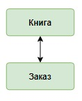
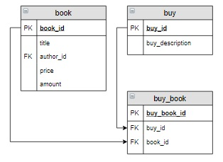
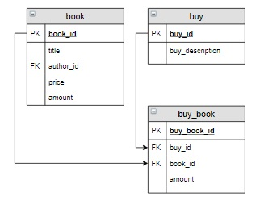
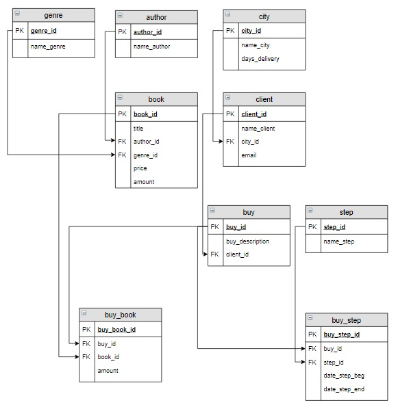

# База данных «Интернет-магазин книг», запросы на выборку

### Содержание
[​Логическая модель базы данных](#T1)<br>
[Запросы на основе трех и более связанных таблиц](#T2)<br>


+ следующую пару таблиц:



+ реализуем связь «многие ко многим»:



+ В описании предметной области указывается, что нужно хранить количество книг, которые включены в заказ. Добавим эту характеристику в таблицу-связку `buy_book`:



___
<br>

<a name="T1"></a>
# Логическая модель базы данных



___
<br>


<a name="T2"></a>
# Запросы на основе трех и более связанных таблиц

### **Пример**

Вывести фамилии всех клиентов, которые заказали книгу Булгакова «Мастер и Маргарита».

Этот запрос строится на основе нескольких таблиц. В нашем случае выбираются название книги из таблицы `book` и фамилия клиента из таблицы `client`. Эти таблицы между собой непосредственно не связаны, поэтому нужно добавить «связующие» таблицы  `buy` и `buy_book`:

Для соединения этих таблиц используется `INNER JOIN`. Рекомендуется связи описывать последовательно: `client` → `buy` → `buy_book` → `book`.  А для соединения использовать пару **первичный ключ** и **внешний ключ** соответствующих таблиц. Например, соединение таблиц `client` и `buy` осуществляется по условию `client.client_id` = `buy.client_id`.

```sql
SELECT DISTINCT name_client
FROM 
    client 
    INNER JOIN buy ON client.client_id = buy.client_id
    INNER JOIN buy_book ON buy_book.buy_id = buy.buy_id
    INNER JOIN book ON buy_book.book_id=book.book_id
WHERE title ='Мастер и Маргарита' and author_id = 1;          

+---------------+
| name_client   |
+---------------+
| Баранов Павел |
| Абрамова Катя |
+---------------+
```

В запросе отбираются уникальные клиенты (`DISTINCT`) так как один и тот же клиент мог заказать одну и ту же книгу несколько раз.
___
<br>
