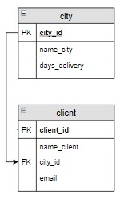
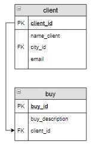
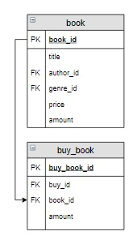
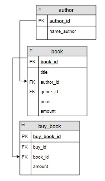

# База данных «Интернет-магазин книг», запросы корректировки

# Содержание
[Запрос на добавление, занесение констант и данные из других таблиц](#T1)<br>
[Запрос на обновление, UPDATE](#T2)<br>
[Создание таблицы, занесение констант и данные из других таблиц CREATE](#T3)<br>
[Запрос на добавление, занесение констант и данные из других таблиц JOIN](#T4)<br>
<br>

<a name="T1"></a>
# Запрос на добавление, занесение констант и данные из других таблиц

В запросах на добавление можно одновременно заносить и константы, и данные из других таблиц. В части запроса `INSERT` , где задается запрос на выборку, в качестве полей для вставки указываются не только поля других таблиц, но и  константы:

```sql
INSERT INTO ... 
SELECT 'Попов Илья', city_id, 'popov@test'
FROM city
WHERE ...;
```


### **Пример**

Включить нового человека в таблицу с клиентами. Его имя **Попов Илья**, его **email popov@test**, проживает он в **Москве**.



```sql
INSERT INTO client (name_client, city_id, email)
SELECT 'Попов Илья', city_id, 'popov@test'
FROM city
WHERE name_city = 'Москва';

SELECT * FROM client;
```
<br>

### **Пример**

Создать новый заказ для **Попова Ильи**. Его комментарий для заказа: «Связаться со мной по вопросу доставки».



```sql
INSERT INTO buy (buy_description, client_id)
SELECT 'Связаться со мной по вопросу доставки', client_id
FROM client
WHERE name_client = 'Попов Илья';

SELECT * FROM buy;
```
___
<br>

<a name="T2"></a>
# Запрос на обновление, UPDATE

### **Пример**

Количество тех книг на складе, которые были включены в заказ с номером 5, уменьшить на то количество, которое в заказе с номером 5  указано.



```sql
UPDATE book b
JOIN buy_book bb USING(book_id)
    SET b.amount = b.amount - bb.amount
WHERE buy_id = 5;

SELECT * FROM book;
```
___
<br>

# Создание таблицы, занесение констант и данные из других таблиц CREATE

### **Пример**

Создать счет (таблицу `buy_pay`) на оплату заказа с номером 5, в который включить название книг, их автора, цену, количество заказанных книг и  стоимость. Последний столбец назвать `Стоимость`. Информацию в таблицу занести в отсортированном по названиям книг виде.



```sql
CREATE TABLE buy_pay AS
SELECT title, name_author, price, bb.amount, price * bb.amount AS 'Стоимость'
FROM buy_book bb
    JOIN book b USING(book_id)
    JOIN author a USING(author_id)
WHERE bb.buy_id = 5
ORDER BY 1;

SELECT * FROM buy_pay;
```
<br>

### **Пример**

Создать общий счет (таблицу `buy_pay`) на оплату заказа с номером 5. Куда включить номер заказа, количество книг в заказе (название столбца `Количество`) и его общую стоимость (название столбца `Итого`). Для решения используйте ОДИН запрос.


```sql
CREATE TABLE buy_pay AS
SELECT buy_id, SUM(bb.amount) AS 'Количество', 
        SUM(price * bb.amount) AS 'Итого'
FROM buy_book bb
    JOIN book b USING(book_id)
WHERE buy_id = 5
GROUP BY 1;

SELECT * FROM buy_pay;
```
___

<br>

# Запрос на добавление, занесение констант и данные из других таблиц JOIN

### **Пример** 

В таблицу `buy_step` для заказа с номером 5 включить все этапы из таблицы `step`, которые должен пройти этот заказ. В столбцы `date_step_beg` и `date_step_end` всех записей занести `Null`.

```sql
INSERT INTO buy_step (buy_id, step_id)
SELECT buy_id, step_id
FROM buy
    CROSS JOIN step
WHERE buy_id = 5;

SELECT * FROM buy_step;
```
___


