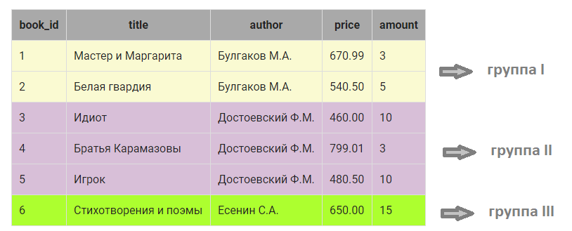
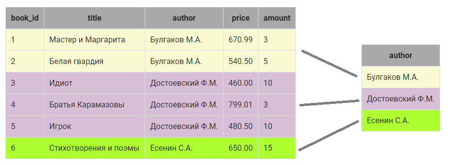
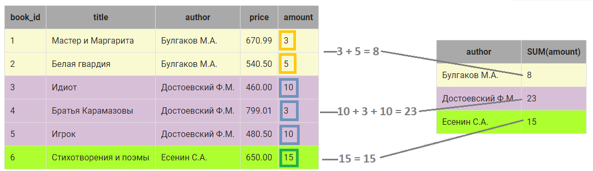
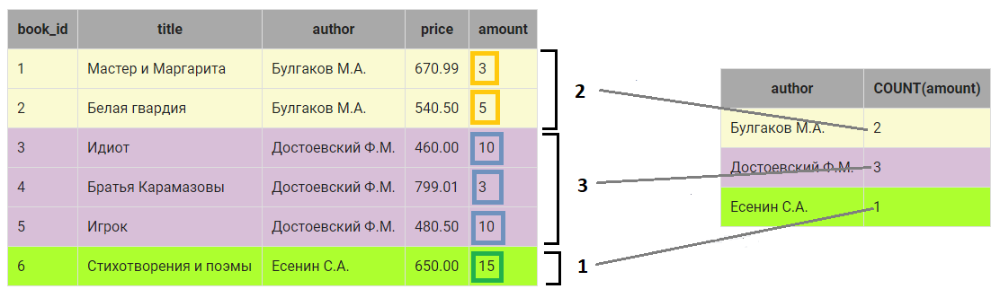

# Запросы, групповые операции

### Содержание <br>
[Выбор уникальных элементов столбца](#T1) <br>
[Выборка данных, групповые функции SUM и COUNT](#T2) <br>
[Выборка данных, групповые функции MIN, MAX и AVG](#T3)<br>
[Выборка данных c вычислением, групповые функции](#T4)<br>
[Вычисления по таблице целиком](#T5)<br>
[Выборка данных по условию, групповые функции](#T6)<br>
[Выборка данных по условию, групповые функции, WHERE и HAVING](#T7)<br>


<br>

### Структура и наполнение таблицы `book`
|book_id | title | author | price | amount|
| ---- | ---- | ---- | ---- | ---- |
|INT PRIMARY KEY AUTO_INCREMENT|	VARCHAR(50)|	VARCHAR(30)|	DECIMAL(8,2)|	INT|
1 | Мастер и Маргарита|	Булгаков М.А.|	670.99|	3|
2 |	Белая гвардия|	Булгаков М.А.|	540.50|	5|
3 |	Идиот |	Достоевский Ф.М. |	460.00 |	10|
4 |	Братья Карамазовы|	Достоевский Ф.М.|	799.01|	3|
5 |	Игрок|	Достоевский Ф.М.|	480.50|	10|
6 |	Стихотворения и поэмы|	Есенин С.А.|	650.00|	15|


<br><a name="T1"></a> 
# Выбор уникальных элементов столбца

`DISTINCT` - используется для того, чтобы отобрать уникальные элементы некоторого столбца. Размещается сразу после `SELECT`

#### **Пример** Выбрать различных авторов.

```SQL
SELECT DISTINCT author
FROM book;

--результат
+------------------+
| author           |
+------------------+
| Булгаков М.А.    |
| Достоевский Ф.М. |
| Есенин С.А.      |
+------------------+
```

Другой способ – использование оператора `GROUP BY`, который группирует данные при выборке, имеющие одинаковые значения в некотором столбце. Столбец, по которому осуществляется группировка, указывается после `GROUP BY` .

С помощью `GROUP BY` можно выбрать уникальные элементы столбца, по которому осуществляется группировка. Результат будет точно такой же как при использовании DISTINCT.

```SQL
SELECT  author
FROM book
GROUP BY author;
```
___


<br><a name="T2"></a> 
# Выборка данных, групповые функции SUM и COUNT

При группировке, можно выполнить различные действия, например, **просуммировать** `SUM` их или найти **количество** `COUNT` элементов в группе.

```SQL
SELECT author, sum(amount), count(amount)
FROM book
GROUP BY author;

--результат

+------------------+-------------+---------------+
| author           | sum(amount) | count(amount) |
+------------------+-------------+---------------+
| Булгаков М.А.    | 8           | 2             |
| Достоевский Ф.М. | 23          | 3             |
| Есенин С.А.      | 15          | 1             |
+------------------+-------------+---------------+
```

1.В таблице `book` определяются строки, в которых в столбце `author` одинаковые значения:



* **группа I** объединяет две записи, у которых в столбце `author` значение Булгаков М.А.;
* **группа II** объединяет три записи, `author` - Достоевский Ф.М.;
* **группа III** объединяет одну запись,`author` - Есенин С.А.

2.Вместо каждой группы в результирующий запрос включается  одна запись. Запись как минимум включает значение столбца, по которому осуществляется группировка - `author`:



3.Дальше можно выполнить вычисления над элементами КАЖДОЙ группы в отдельности, например, посчитать общее количество экземпляров книг каждого автора. Используется групповая функция `SUM(amount)`, в скобках столбец, по которому нужно выполнить суммирование:



4.Также можно посчитать, сколько записей относится к группе. Используется функция `COUNT()`, в скобках можно указать ЛЮБОЙ столбец из группы, если группа не содержит пустых значений:



> Рекомендуется всем  вычисляемым столбцам давать имя.

> `COUNT(*)` —  подсчитывает  все записи, относящиеся к группе, в том числе и со значением NULL;<br>
`COUNT(имя_столбца)` — возвращает количество записей конкретного столбца (только NOT NULL), относящихся к группе.
___


<br><a name="T3"></a> 
# Выборка данных, групповые функции MIN, MAX и AVG

`MIN()`, `MAX()` и `AVG()`, вычисляют минимальное, максимальное и среднее значение элементов столбца, относящихся к группе.

#### **Пример** Вывести минимальную цену книги каждого автора

```SQL
SELECT author, 
    MIN(price) AS Минимальная_цена, 
    MAX(price) AS Максимальная_цена, 
    ROUND(AVG(price),2) AS Средняя_цена
FROM book
GROUP BY author;

--результат:

+------------------+------------------+-------------------+--------------+
| author           | Минимальная_цена | Максимальная_цена | Средняя_цена |
+------------------+------------------+-------------------+--------------+
| Булгаков М.А.    | 540.50           | 670.99            | 605.75       |
| Достоевский Ф.М. | 460.00           | 799.01            | 579.84       |
| Есенин С.А.      | 650.00           | 650.00            | 650.00       |
+------------------+------------------+-------------------+--------------+
```
___

<br><a name="T4"></a>
# Выборка данных c вычислением, групповые функции

В качестве аргумента групповых функций  SQL может использоваться не только столбец, но и любое допустимое в SQL арифметическое выражение.

#### **Пример** Вывести суммарную стоимость книг каждого автора.

```SQL
SELECT author, SUM(price * amount) AS Стоимость
FROM book
GROUP BY author;

--результат
+------------------+-----------+
| author           | Стоимость |
+------------------+-----------+
| Булгаков М.А.    | 4715.47   |
| Достоевский Ф.М. | 11802.03  |
| Есенин С.А.      | 9750.00   |
+------------------+-----------+
```
___

<br><a name="T5"></a>
# Вычисления по таблице целиком

Групповые функции позволяют вычислять итоговые значения по всей таблице. Например, можно посчитать общее количество книг на складе, вычислить суммарную стоимость и пр. Для ключевые слова GROUP BY опускаем.

#### **Пример** Посчитать общее количество экземпляров книг на складе и их стоимость .

```SQL
SELECT SUM(amount) AS Количество, 
    SUM(price * amount) AS Стоимость
FROM book;

--результат:
+------------+-----------+
| Количество | Стоимость |
+------------+-----------+
| 46         | 26267.50  |
+------------+-----------+
```
___

<br><a name="T6"></a>
# Выборка данных по условию, групповые функции

В запросы с групповыми функциями можно включать условие отбора строк, записывается после `WHERE`. В запросах с групповыми функциями вместо `WHERE` используется ключевое слово `HAVING` , которое размещается после оператора `GROUP BY`.

#### **Пример** Найти минимальную и максимальную цену книг всех авторов, общая стоимость книг которых больше 5000.

```SQL
SELECT author,
    MIN(price) AS Минимальная_цена, 
    MAX(price) AS Максимальная_цена
FROM book
GROUP BY author
HAVING SUM(price * amount) > 5000; 


--результат:
+------------------+------------------+-------------------+
| author           | Минимальная_цена | Максимальная_цена |
+------------------+------------------+-------------------+
| Достоевский Ф.М. | 460.00           | 799.01            |
| Есенин С.А.      | 650.00           | 650.00            |
+------------------+------------------+-------------------+
```

> запросах с группировкой можно сортировать данные.

#### **Пример** Найти минимальную и максимальную цену книг всех авторов, общая стоимость книг которых больше 5000. Результат вывести по убыванию минимальной цены.

```SQL
SELECT author,
    MIN(price) AS Минимальная_цена, 
    MAX(price) AS Максимальная_цена
FROM book
GROUP BY author
HAVING SUM(price * amount) > 5000 
ORDER BY Минимальная_цена DESC;


--результат:

+------------------+------------------+-------------------+
| author           | Минимальная_цена | Максимальная_цена |
+------------------+------------------+-------------------+
| Есенин С.А.      | 650.00           | 650.00            |
| Достоевский Ф.М. | 460.00           | 799.01            |
+------------------+------------------+-------------------+
```

> Если  столбцу присвоено имя с помощью AS, то можно использовать это имя при указании столбца, по которому выполняется сортировка 
___


<br><a name="T7"></a>
# Выборка данных по условию, групповые функции, WHERE и HAVING

`WHERE` и `HAVING` могут использоваться в одном запросе. При этом необходимо учитывать **порядок выполнения  SQL запроса на выборку на СЕРВЕРЕ:**
1. FROM
2. WHERE
3. GROUP BY
4. HAVING
5. SELECT
6. ORDER BY

Сначала определяется таблица, из которой выбираются данные `FROM`, затем из этой таблицы отбираются записи в соответствии с условием  `WHERE`, выбранные данные агрегируются `GROUP BY`,  из агрегированных записей выбираются те, которые удовлетворяют условию после `HAVING`. Потом формируются данные результирующей выборки, как это указано после `SELECT` ( вычисляются выражения, присваиваются имена и пр. ). Результирующая выборка сортируется, как указано после `ORDER BY`.

#### **Пример** Вывести максимальную и минимальную цену книг каждого автора, кроме Есенина, количество экземпляров книг которого больше 10. 

```SQL
SELECT author,
    MIN(price) AS Минимальная_цена,
    MAX(price) AS Максимальная_цена
FROM book
WHERE author <> 'Есенин С.А.'
GROUP BY author
HAVING SUM(amount) > 10;


--результат:

+------------------+------------------+-------------------+
| author           | Минимальная_цена | Максимальная_цена |
+------------------+------------------+-------------------+
| Достоевский Ф.М. | 460.00           | 799.01            |
+------------------+------------------+-------------------+
```
Другим способом решения примера является запрос:

```SQL
SELECT author,
    MIN(price) AS Минимальная_цена,
    MAX(price) AS Максимальная_цена
FROM book
GROUP BY author
HAVING SUM(amount) > 10 AND author <> 'Есенин С.А.';
```

>Не смотря на то что результат будет одинаковым, **так делать не рекомендуется**. «Потому что как написано - запрос сначала выбирает всех авторов, потом выводит данные, рассчитывая минимальное и максимальное значение цены для каждого, и только после всего убирает Есенина. Можно убрать Есенина в данном случае раньше и не использовать ресурсы базы для расчета его минимального и максимального значения, как это сделано в первом варианте.

#### **Пример** Посчитать стоимость всех экземпляров каждого автора без учета книг «Идиот» и «Белая гвардия». В результат включить только тех авторов, у которых суммарная стоимость книг (без учета книг «Идиот» и «Белая гвардия») более 5000 руб. Вычисляемый столбец назвать Стоимость. Результат отсортировать по убыванию стоимости.

```SQL
SELECT author,
    SUM(price * amount) AS Стоимость
FROM book
WHERE title <> 'Идиот' AND title <> 'Белая гвардия'
GROUP BY author
HAVING Стоимость > 5000
ORDER BY author DESC;


--результат:

+------------------+-----------+
| author           | Стоимость |
+------------------+-----------+
| Есенин С.А.      | 9750.00   |
| Достоевский Ф.М. | 7202.03   |
+------------------+-----------+
```
___


