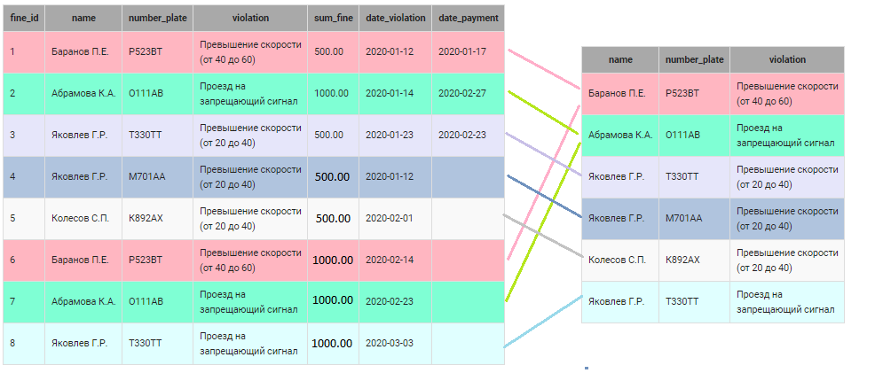
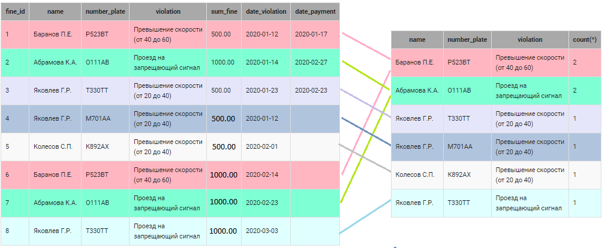
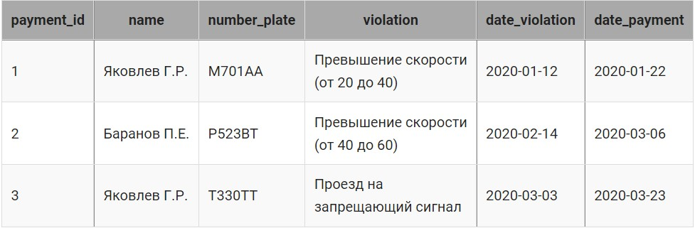

# Таблица "Нарушения ПДД", запросы корректировки

### Содержание
[Использование временного имени таблицы (алиаса)](#T1)<br>
[Группировка данных по нескольким столбцам](#T2)<br>
<br>

В таблице `fine`  представлена информация о начисленных водителям штрафах за нарушения (ПДД) (фамилия водителя, номер машины, описание нарушения, сумма штрафа, дата совершения нарушения и дата оплаты штрафа):

#### Создание таблицы `fine`:
 ```SQL
CREATE TABLE fine (
    fine_id INT PRIMARY KEY AUTO_INCREMENT,
    name VARCHAR(30),
    number_plate VARCHAR(6),
    violation VARCHAR(50),
    sum_fine DECIMAL(8, 2), -- вещественное, максимальная длина 8, количество знаков после запятой 2
    date_violation DATE,
    date_payment DATE
);
 ```

#### Пример заполнения таблицы `fine`
```SQL
INSERT INTO fine (name, number_plate, violation, sum_fine, date_violation, date_payment)
VALUES ('Баранов П.Е.', 'Р523ВТ', 'Превышение скорости(от 40 до 60)', NULL, '2020-02-14 ', NULL),
       ('Абрамова К.А.', 'О111АВ', 'Проезд на запрещающий сигнал', NULL, '2020-02-23', NULL),
       ('Яковлев Г.Р.', 'Т330ТТ', 'Проезд на запрещающий сигнал', NULL, '2020-03-03', NULL),
       ('Баранов П.Е.', 'Р523ВТ', 'Превышение скорости(от 40 до 60)', 500.00, '2020-01-12', '2020-01-17'),
       ('Абрамова К.А.', 'О111АВ', 'Проезд на запрещающий сигнал', 1000.00, '2020-01-14', '2020-02-27'),
       ('Яковлев Г.Р.', 'Т330ТТ', 'Превышение скорости(от 20 до 40)', 500.00, '2020-01-23', '2020-02-23'),
       ('Яковлев Г.Р.', 'М701АА', 'Превышение скорости(от 20 до 40)', NULL, '2020-01-12', NULL),
       ('Колесов С.П.', 'К892АХ', 'Превышение скорости(от 20 до 40)', NULL, '2020-02-01', NULL);
```

В таблицу  `traffic_violation` занесены нарушения ПДД и соответствующие штрафы (в рублях): 

| violation_id | violation | sum_fine |
 ----------- | ---------- | --------- |
 INT PRIMARY KEY AUTO_INCREMENT | VARCHAR(50) | DECIMAL(8,2)|
 
___
<br>

<a name="T1"></a>
# Использование временного имени таблицы (алиаса)

Чтобы не писать название таблицы каждый раз, удобно использовать алиасы.

Алиас, это псевдоним, который мы присваивали столбцам после ключевого слова AS( [шаг](https://github.com/EMIR1HUB/All_Conspectus/blob/main/SQL/2_base_SelectData.md) ). Алиасы можно использовать и для таблиц. Это становится актуальным, при увеличении числа используемых таблиц. Псевдонимы помогают сделать запрос чище и читабельнее.

### Для присваивания псевдонима существует 2 варианта:

+ с использованием ключевого слова `AS` 
```SQL
FROM fine AS f, traffic_violation AS tv
```
+ и без него
```SQL
FROM fine f, traffic_violation tv
```

После присвоения таблице алиаса, он используется во всех разделах запроса, в котором алиас задан.

```sql
WHERE f.violation = tv.violation
```

#### **Пример** Для тех, кто уже оплатил штраф, вывести информацию о том, изменялась ли стандартная сумма штрафа.

```sql
SELECT  f.name, f.number_plate, f.violation, 
   if(
    f.sum_fine = tv.sum_fine, "Стандартная сумма штрафа", 
    if(
      f.sum_fine < tv.sum_fine, "Уменьшенная сумма штрафа", "Увеличенная сумма штрафа"
    )
  ) AS description               
FROM  fine f, traffic_violation tv
WHERE tv.violation = f.violation and f.sum_fine IS NOT Null;

--результат

+---------------+--------------+----------------------------------+--------------------------+
| name          | number_plate | violation                        | description              |
+---------------+--------------+----------------------------------+--------------------------+
| Баранов П.Е.  | Р523ВТ       | Превышение скорости(от 40 до 60) | Уменьшенная сумма штрафа |
| Абрамова К.А. | О111АВ       | Проезд на запрещающий сигнал     | Стандартная сумма штрафа |
| Яковлев Г.Р.  | Т330ТТ       | Превышение скорости(от 20 до 40) | Стандартная сумма штрафа |
+---------------+--------------+----------------------------------+--------------------------+
```

#### **Пример** Занести в таблицу `fine` суммы штрафов, которые должен оплатить водитель, в соответствии с данными из таблицы `traffic_violation`. При этом суммы заносить только в пустые поля столбца  `sum_fine`.

> Важно! Сравнение значения столбца с пустым значением осуществляется с помощью оператора IS NULL.

```SQL
UPDATE fine AS f, traffic_violation AS tv
SET f.sum_fine = tv.sum_fine
WHERE f.violation = tv.violation AND f.sum_fine IS NULL;

SELECT * FROM fine;
```
___
<br>

<a nmae="T2"></a>
# Группировка данных по нескольким столбцам

В разделе `GROUP BY` можно указывать несколько столбцов, разделяя их запятыми. Тогда к одной группе будут относиться записи, у которых значения столбцов, входящих в группу, равны. Рассмотрим группировку по нескольким столбцам на примере следующего запроса:

```sql
SELECT name, number_plate, violation, count(*)
FROM fine
GROUP BY name, number_plate, violation;
```

1. Сначала записи таблицы  `fine` разделяются на группы. В каждую группу включаются строки, у которых равны значения в столбцах `name`, `number_plate` и `violation`  соответственно. Получается 6 групп.



2. Затем вычисляется функция `count(*)`, которая определяет количество записей в каждой группе. Получается, что к первым двум группам относятся по две записи, ко всем остальным - по одной.



> **Важно!** В разделе `GROUP BY` нужно перечислять все НЕАГРЕГИРОВАННЫЕ столбцы (к которым не применяются групповые функции) из `SELECT`.

#### **Пример** Вывести фамилию, номер машины и нарушение только для тех водителей, которые на одной машине нарушили одно и то же правило   два и более раз. При этом учитывать все нарушения, независимо от того оплачены они или нет. Информацию отсортировать в алфавитном порядке, сначала по фамилии водителя, потом по номеру машины и, наконец, по нарушению.

```sql
SELECT name, number_plate, violation
FROM fine
GROUP BY name, number_plate, violation
HAVING COUNT(*) >= 2
ORDER BY 1, 2, 3;

--результат
+---------------+--------------+----------------------------------+
| name          | number_plate | violation                        |
+---------------+--------------+----------------------------------+
| Абрамова К.А. | О111АВ       | Проезд на запрещающий сигнал     |
| Баранов П.Е.  | Р523ВТ       | Превышение скорости(от 40 до 60) |
+---------------+--------------+----------------------------------+
```

В таблице `fine` увеличить в два раза сумму неоплаченных штрафов для отобранных на предыдущем шаге записей.

```sql
--первый способ
UPDATE fine AS f, 
    (SELECT name, number_plate, violation
     FROM fine
     GROUP BY name, number_plate, violation
     HAVING COUNT(*) >= 2
     ) AS temp
SET f.sum_fine = f.sum_fine * 2 
WHERE date_payment IS NULL AND
    f.name = temp.name AND
    f.violation = temp.violation;

SELECT * FROM fine;

-- второй способ
UPDATE fine AS f
SET f.sum_fine = f.sum_fine * 2 
WHERE date_payment IS NULL AND (name, number_plate, violation) IN
    (SELECT * FROM (SELECT name, number_plate, violation
                    FROM fine
                    GROUP BY name, number_plate, violation
                    HAVING COUNT(*) >= 2) AS temp);
```
___
<br>

## **Пример** 
Водители оплачивают свои штрафы. В таблице `payment` занесены даты их оплаты:



Необходимо:
+ в таблицу `fine` занести дату оплаты соответствующего штрафа из таблицы payment; 
+ уменьшить начисленный штраф в таблице `fine` в два раза  (только для тех штрафов, информация о которых занесена в таблицу `payment`) , если оплата произведена не позднее 20 дней со дня нарушения.

```sql
UPDATE fine AS f, payment AS p
SET f.sum_fine = IF(DATEDIFF(p.date_payment,f.date_violation) <= 20, f.sum_fine/2, f.sum_fine),
    f.date_payment = p.date_payment
WHERE f.date_payment IS NULL AND
    (f.name, f.number_plate, f.violation) = (p.name, p.number_plate, p.violation);

SELECT * FROM fine;
```
___
<br>

## **Пример** 
Создать новую таблицу `back_payment`, куда внести информацию о неоплаченных штрафах (Фамилию и инициалы водителя, номер машины, нарушение, сумму штрафа  и  дату нарушения) из таблицы `fine`.

```sql
CREATE TABLE back_payment AS
SELECT name, number_plate, violation, sum_fine, date_violation
FROM fine
WHERE date_payment IS NULL;

SELECT * FROM back_payment;

--результат

+---------------+--------------+----------------------------------+----------+----------------+
| name          | number_plate | violation                        | sum_fine | date_violation |
+---------------+--------------+----------------------------------+----------+----------------+
| Колесов С.П.  | К892АХ       | Превышение скорости(от 20 до 40) | 500.00   | 2020-02-01     |
| Абрамова К.А. | О111АВ       | Проезд на запрещающий сигнал     | 2000.00  | 2020-02-23     |
+---------------+--------------+----------------------------------+----------+----------------+
```
___
<br>

## **Пример** 
Удалить из таблицы `fine` информацию о нарушениях, совершенных раньше 1 февраля 2020 года. 

```sql
DELETE FROM fine
WHERE date_violation < '2020-02-01';
```
___