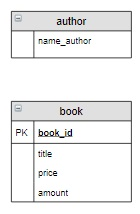

# Связь между таблицами

### Содержание
[Связь «один ко многим»](#T1) 

 

# Связь «один ко многим»

Рассмотрим таблицу `book`(в ней столбец `author` переименован в `name_author`):

book_id | title | name_author | price | amount |
------  | ----- | ----------  | ----- | ------ |
1       | Мастер и Маргарита  | Булгаков М.А. | 670.99 | 3     |
2       | Белая гвардия      | Булгаков М.А. | 540.50 | 5     |

В этой таблице фамилии авторов повторяются для нескольких книг. А что, если придется вместо инициалов для каждого автора хранить его полное имя и отчество? Тогда, если в таблице содержится информация о 50 книгах Достоевского, придется 50 раз исправлять «Ф.М.» на «Федор Михайлович». При этом, если в некоторых записях использовать «Фёдор Михайлович» (c буквой ё), то мы вообще получим двух разных авторов... 

Чтобы устранить эту проблему в реляционных базах данных создается новая таблица `author`,  в которой перечисляются все различные авторы, а затем эта таблица связывается с таблицей `book`. При этом такая связь называется «***один ко многим***», таблица `author` называется главной, таблица `book` – связанной или подчиненной. 

Связь «***один ко многим***» имеет место, когда одной записи главной таблицы соответствует несколько записей связанной таблицы, а каждой записи связанной таблицы соответствует только одна запись главной таблицы.

`Автор --> Книга`

Один автор может написать несколько книг, а одна книга написана только одним автором. Для каждой книги известны ее количество и цена.

1. Создать таблицу `author`,  в которую включить уникальных авторов книг, хранящихся на складе:

2. Обе таблицы должны содержать первичный ключ, в таблице  book он уже есть,  в таблицу authorдобавим ключ author_id:

