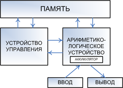
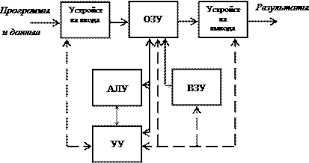
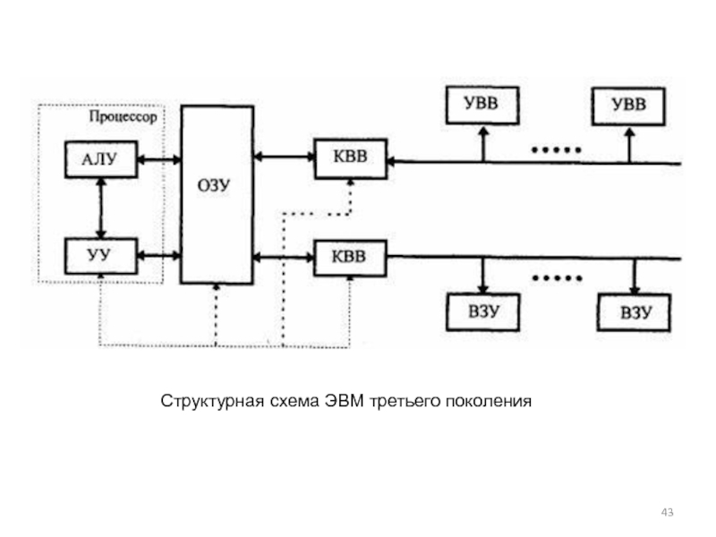
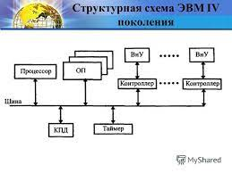

# Структурно функционые схемы средств Вычислительной техники

## Принципы Фон Неймана 
1. программы управления - все вычисления предусмотренные алгоритмом  вычисления, должны быть предусмотренны в виде 

2. Двоичное кодирование - все данные и команды кодируются двоичным кодом

3. Однородность памяти - все команды и данные хранятся в одной и той же памяти, и внешне в памяти не разлечимы.

4. Адресность - состоит из пронумерованных ячеек и процессору в произвольный момент доступна любая ячейка

Для реализации принципа Фон Неймана компьтер должен иметь следующие устройства:

1. Арифметика-логического устройства (АЛУ). Выполняет арифметические и логические операции
2. Устройство управления (АУ). Организует процесс выполнения программ состоящих из наборов команд
3. Запоменающее устройство (ЗУ). Память для хранения программ и данных
4. Внешние устройства для ввода и вывода данных 
____

## Поколение 1-2

В компьтерах первого поколения введеная информация сначалах запоменается в оперативной памяти (ОЗУ), а после переносится во внешнее запоменающее устройства преднозначенное для хранения информации. Вызываемое из оперативной памяти комманды дешефруются устройством управления, т.е. определяется код операции который необходимо выполнить и адресса операндов принимающих участие в данной операции.

АУ выполняет арифметические-логические операции над данными, резулььтаты полученные после выполнения всей программы вычисленний передаются на устройство ввода-вывода 
____

## Поколение 3

В компьтерах 3-го поколения происходит усложнение структуры за счет разделения процессов  ввода-ввывода информации и процессов ее обработки. В структуре появляются устройства:

1. УВВ - устройство управления обменом информации 
2. КВВ - каналлы ввода-вывода. Намечается тенндеция к денетрилизации управления и паререльной работе оотдельных устройств, что повышает повысить быстродействие компьютеров

___

## Поколение 4

Структура 4-го покления соединения всех устройств обеспечивается с помощью общей Шины, представляющее собой линии передачи данных, адрессов, сигналов управления и питания. Все передачи данных по шине осущ. по управлениям сервесных програм.

Ядро ЭВМ образует процессор и основная память состоящее из ОЗУ и ПЗУ. Подключение всех внешних устровст обеспечивается через соответсвующие адапторы и контроллеры. Добавляется таймер - устройство измерения времени и контроллер прямого доступа к памяти (КПД).

КПД - устройство обеспечивающее доступ к основной памяти, минуюя процессор. 
